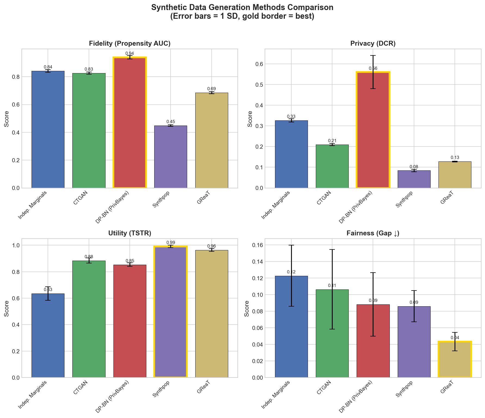
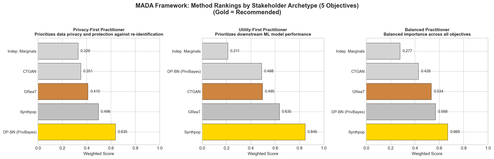
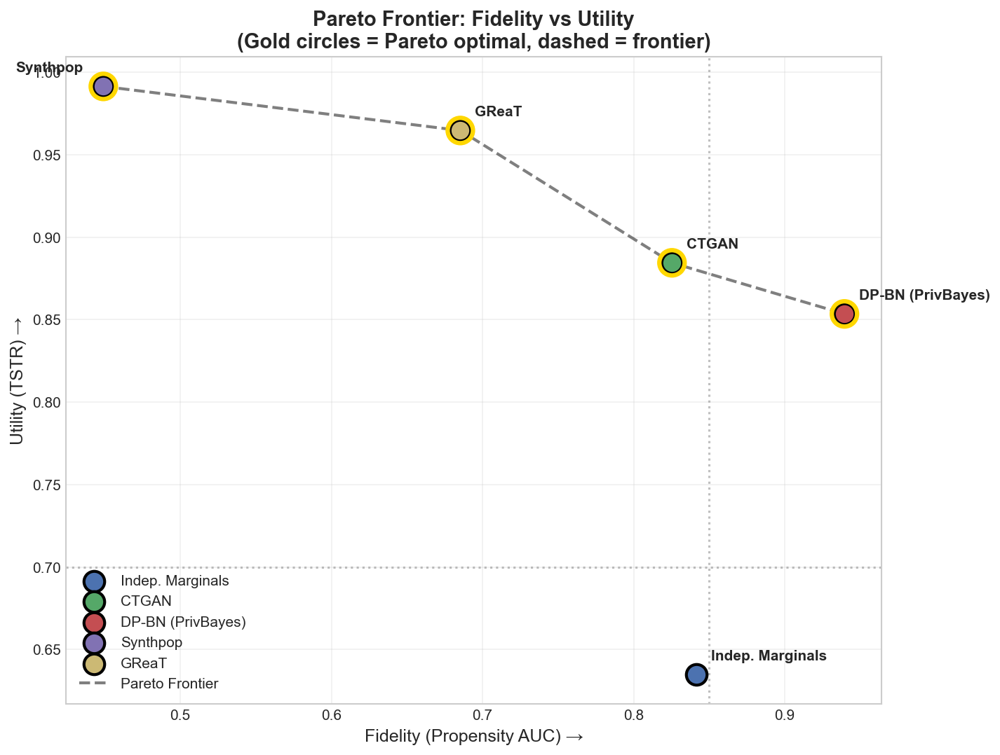
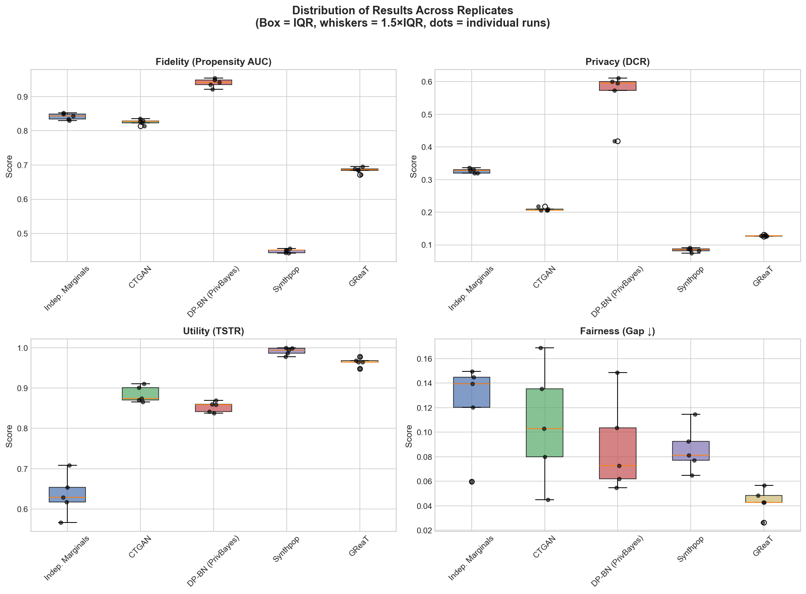

# A Multiattribute Decision Analysis Framework for Selecting Synthetic Data Generation Methods: Balancing Fidelity, Privacy, Fairness, and Cost

*Michael Koo & Alfonso Berumen*

## Abstract

**Problem Statement:** Practitioners selecting a synthetic tabular data generation method face a multiattribute decision spanning distributional fidelity, privacy, fairness, and computational cost. The benchmarking literature increasingly reports performance matrices, but it typically stops short of translating metrics into decision-relevant guidance.

**Methodology:** We develop a decision-analytic framework that transforms method comparison into a structured value assessment. We construct a value-focused objectives hierarchy, define five primary measures (propensity AUC, DCR 5th percentile, TSTR F1 ratio, maximum subgroup utility gap, and total time), map measures to a common [0,1] value scale via single-dimensional value functions, and aggregate via an additive multiattribute value model. To represent heterogeneous practitioner preferences without requiring stakeholder elicitation, we specify swing weights via three stakeholder archetypes and examine robustness through sensitivity analysis. We further apply the decision-focused transformation of Dees et al. (2010) and quantify the value of additional benchmarking effort via a value of information analysis (Keisler 2004).

**Results:** We demonstrate the approach on the 2024 ACS PUMS person-level microdata for California (N=35,000 adult records), evaluating five representative method classes: Independent Marginals, Synthpop, CTGAN, a differentially private Bayesian network approach (PrivBayes-inspired), and GReaT.

**Practical Implications:** The framework shifts the question from “which method is best” to “which method is best for your objectives,” and provides an auditable template for organizations to (i) benchmark methods, (ii) make tradeoffs explicit, and (iii) identify when comprehensive evaluation is—and is not—worth the cost.

**Keywords:** synthetic data generation, multiattribute utility theory, decision analysis, privacy-utility tradeoff, tabular data

---

# 1. Introduction

## 1.1 The Business Practitioner's Decision Problem

A data scientist at a public health agency needs to share demographic data with external researchers while protecting individual patient privacy. A survey methodologist at a public agency wants to create public-use microdata files that preserve complex, multivariate relationships. A machine learning engineer at a Fortune 500 company requires training data that accurately represents minority subgroups without exposing real individuals. Stakeholders will then use outputs from any of these sources to inform strategic decisions. Each faces a common, multi-faceted decision problem: (1) selecting the most appropriate synthetic data generation method, and (2) validating the resulting outputs before relying on them to make a major decision.

Organizations are increasingly relying on data analytics and Artificial Intelligence (AI), yet they face tension between leveraging data for innovation and protecting privacy (Harvard Business Review Analytic Services, 2021). Second, in domains from finance to healthcare, strict regulations (e.g. GDPR, CCPA) restrict the use and sharing of sensitive data (Harvard Business Review Analytic Services, 2021). Indeed, cross-border data transfers have become especially impacted as for example, the EU's Schrems II decision in 2020 invalidated the EU–US Privacy Shield framework, throwing into question how companies can legally move personal data overseas (International Association of Privacy Professionals, 2024). A third key driver is the need for faster experimentation and product development. Using synthetic data, firms can test algorithms, products, or scenarios quickly without waiting on slow or expensive data gathering cycles. For example, the health insurance company Humana found that synthetic data accelerated testing of new technologies: what used to take months of compliance checking with real data could be done in days with synthetic data, speeding up innovation (Harvard Business Review Analytic Services, 2021).

Synthetic data (SD) can be defined as artificially generated datasets that preserve the statistical properties of real data without exposing actual sensitive information (Eastwood, 2023). More clearly: "Synthetic data is created rather than collected from real-world sources, with the aim of addressing varied challenges of data unavailability, scarcity, privacy or representativeness" (World Economic Forum, 2025). Synthetic data is now used to do at least the following: (1) share and analyze sensitive data without exposing personally identifiable information (PII) (Giuffrè & Shung, 2023), (2) augment sparse or imbalanced datasets to address data scarcity (Goyal & Mahmoud, 2024), (3) simulate scenarios and stress tests, particularly for rare or costly events (WEKA, 2023), and (4) enable AI model or black-box Machine Learning (ML) model explainability through local "what-if" neighborhoods in methods such as LIME (Guidotti et al., 2023). At the same time, both journals and regulators emphasize the need for systematic evidence on utility and privacy trade-offs (Adams et al., 2025; El Emam et al., 2022). Estimates suggest that synthetic data usage likely exceeded 60% for AI applications in 2024 (Zewe, 2025). Major technology companies including OpenAI, Apple, Microsoft, Google, Meta, and IBM are touting use of synthetic data for AI development and have highlighted their applications' capabilities in producing synthetic data for industry use (Kapania et al., 2025).

Practitioners view synthetic data as a valuable tool for tackling data scarcity, high collection costs, and privacy concerns, while also helping diversify datasets and evaluate model performance (Kapania et al., 2025). Even government agencies are taking note. In 2023 the U.S. Department of Homeland Security issued a call for solutions to generate synthetic data for machine learning in cases where real data is scarce or sensitive, highlighting the technology's strategic importance for public sector innovation (U.S. Department of Homeland Security, Science & Technology Directorate, 2024). Yet, wide adoption presents what we see as a seemingly less acknowledged but important dilemma around best practices.

The core decision problem is which synthetic data approach to use and how to evaluate the resulting output. Synthetic data generation has quickly emerged as a promising approach for enabling data sharing, augmenting training datasets, and protecting privacy (Jordon et al., 2022). As a result, the methodological landscape has expanded rapidly, from statistical approaches such as sequential regression and non‑parametric CART‑based synthesis (Nowok et al., 2016) to more "black‑box" deep learning methods including conditional generative adversarial networks (GANs) for tabular data (Xu et al., 2019) and transformer‑based language models for realistic tabular data generation (Borisov et al., 2023), each embodying different assumptions about data structure and entailing distinct trade‑offs.

Recent practitioner-focused research by Kapania et al. (2025) reveals that decision-makers in industry struggle with method selection and evaluation. Through 29 interviews with AI practitioners and responsible AI experts, they document pervasive challenges: practitioners lack rigorous validation protocols, rely on manual inspection that cannot scale easily, and have difficulty controlling synthetic data outputs to accurately represent underrepresented groups. Consider the following quote: "Honestly, people just don't want to do [the validation] right now because of the urgency associated with everything" (Kapania et al., 2025). We feel the authors identify a fundamental gap between the growing use of synthetic data and the development of best practices for its responsible deployment. This provides an opportunity for guidance driven by Decision Science as the domain has crossed both general decision-making and leveraging data analysis, primarily mathematical, for decision-making.

We propose that Decision Analysis approaches can provide a reliable framework to assess use cases for synthetic data. Trends in business, industry, government, and society have heightened attention to Data Analytics, Machine Learning, and AI methods while the influence of Decision Analysis has concurrently developed an increased focus in these methodological advances (Bier & French, 2020). Additionally, there is a recognized overlap between data science methods for decision-making and the methods of expected-utility decision theory (Bier & French, 2020). Here, we see an opportunity for both translation of synthetic data approaches and highlighting a clear relationship between decisions around synthetic data and decision theory; however for it to be relevant to practice we argue a framework requires a practitioner lens.

For a modern perspective, Phillips (2025) provides a practitioner-focused view on the ingredients for good decisions with structure including objectives, criteria, options, events, and outcomes and content to include consequences, preference values, trade-offs, probabilities, and risk attitude. Phillips (2025) further argues the process for creating any decision model includes: 1) considering context; 2) framing the problem; 3) providing content or information; 4) exploring results; and 5) agreeing on a way forward. The author finds these as the fifteen ingredients for Decision Technology but suggests the actual elements required to address a decision may be variable depending on the context (Phillips, 2025). More importantly, it is argued that a requisite decision model, described as a transitional object, must be sufficient in form and content to resolve a problem but should be seen as an art that requires social skills in interfacing with stakeholders (Phillips, 2025). Although we cannot directly facilitate organizational synthetic data decisions to co-create requisite models, fully capturing nuances like data usage, evaluation, and real-world consequences, a streamlined methodology offers practitioners a practical, structured alternative.

## 1.2 Overview of Current Business Applications

Across business and data science domains, synthetic data is increasingly used to mitigate data scarcity, high collection costs, and privacy or regulatory constraints, with practitioners highlighting its value for bias reduction, privacy protection, and model development or scoring (Kapania et al., 2025; Eastwood, 2023). Organizations generate artificial datasets that mirror real ones so they can incorporate data-driven decision-making despite strict regulations or sparse data environments, a trend reflected in forecasts that a large share of business AI training data will be synthetically generated (Eastwood, 2023). The World Economic Forum recently released a briefing paper titled "Synthetic Data: The New Data Frontier" which explicitly suggests synthetic data enables robust analytics to facilitate data-driven decision-making (World Economic Forum, 2025).

Synthetic data can be created in multiple formats, such as structured tabular records, time-series, text, images, video, and graphs, enabling teams to analyze patterns, build algorithms, and test software while keeping sensitive details confidential (Giuffrè & Shung, 2023). Tabular synthetic data, in particular, is the dominant format in business settings because most enterprise information systems store customer records, transactions, and operational metrics in structured, table-like databases, making it the natural substrate for analytics and AI in finance, retail, and other process areas and functions. For example, datasets or databases that involve people are typically tabular in format in which each record corresponds to a person such as a customer or patient, and the columns represent characteristics such as demographics or activity. Tabular data in its cleanest form can further be described as structured data that is ready for mathematical or statistical analysis.

Because of this ubiquity, synthetic data research has placed particular emphasis on tabular data generation methods. For example, Shi et al. (2025) describe tabular data as "the most prevalent and important data formats in real-world applications such as healthcare, finance, and education," underscoring its importance in business contexts. Similarly, Pathare et al. (2023) evaluate multiple synthetic tabular generation techniques across balanced and imbalanced datasets, reflecting how central structured, row-and-column data are to applied machine learning. Reviews of generative modeling tools for tabular data (Figueira et al., 2022) and systematic surveys of evaluation approaches (Shi et al., 2025) further highlight that business-critical datasets are typically stored and exchanged in tabular form, reinforcing why synthetic methods for this format dominate both academic and practitioner attention.

In marketing, synthetic data supports customer analytics, pricing, and targeting while protecting individual-level information. For example, Anand and Lee (2023) show that a shared GAN-based generator can produce synthetic customer records that preserve key behavioral patterns, allowing external partners to optimize price markups and targeting decisions with performance close to models trained on real data. Other work using Nielsen scanner data demonstrates that Bayesian synthetic data can maintain accurate estimates of elasticities and promotion effects, avoiding the aggregation bias and information loss that occur with traditional anonymization methods such as heavy aggregation or addition of noise (Schneider, Jagpal, & Gupta, 2018). Recent studies also use synthetic measures derived from visual data and generative AI to support market research, brand valuation, and perceptual mapping, including synthetic survey responses and digital consumer "twins" that closely track human survey results (Feng, Li, & Zhang, 2025; Grewal, Satornino, Davenport, & Guha, 2025; Korst, Puntoni, & Toubia, 2025; Li, Castelo, Katona, & Sarvary, 2024; Columbia Business School, 2025).

In human resources and people analytics, synthetic data is promoted as a way to reconcile innovation with privacy, trust, and legal compliance when handling sensitive employee records (SHRM, 2024a, 2024b, 2024c, 2025). HR and people analytics teams use synthetic workforce datasets to explore retention drivers, DEI outcomes, or performance patterns, collaborate with external vendors, and prototype predictive models without exposing real employees' data, aligning with emerging privacy guidance and cross-border transfer safeguards (International Association of Privacy Professionals (IAPP), 2024; K2View, 2025).

Healthcare has likewise become a leading domain: hospitals and researchers employ synthetic electronic health records and medical images to enable privacy-preserving research, algorithm training, and patient profiling while meeting HIPAA and ethical requirements, as evidenced by deployments such as Washington University's use of MDClone for COVID-19 studies and broader analyses of synthetic health data for personalized medicine, public health, and regulatory evaluation (Washington University School of Medicine, 2021; Nisevic, Milojevic, & Spajic, 2025; Mendes, Barbar, & Refaie, 2025; Giuffrè & Shung, 2023; Kaabachi et al., 2025; Yoon et al., 2023; CDC, 2025; Gonzales et al., 2025).

In finance and other regulated sectors, banks and insurers employ synthetic transaction data for fraud detection, anti-money laundering (AML), and risk modeling, while manufacturing, telecom, automotive, and robotics organizations use synthetic data and scenarios to support quality control, predictive maintenance, cyberattack simulation, and training of autonomous systems (Harvard Business Review Analytic Services, 2021; NayaOne, 2025; AIMultiple, 2025). Adjacent to these applications, Yoshioka (2024) demonstrates how large-scale synthetic financial data, generated from a limited set of listed firms, can be used to train machine learning models that more accurately estimate unrecorded intangible assets across industries.

In short, synthetic data's appeal spans virtually every data-reliant domain, including healthcare, finance, automotive, retail, manufacturing, insurance, and beyond. Organizations therefore need guidance on best practices as practitioners and regulators work to establish standards amid rapid industry adoption. Meanwhile, the research literature shows limitations, including inconsistent validation methods, reproducibility challenges, bias propagation, regulatory gaps, and difficulties in statistical inference or forward prediction.

## 1.3 Limitations of Current Literature

The synthetic data evaluation literature has grown substantially, yet it offers limited decision support. Kaabachi et al. (2025), in a comprehensive review of 73 studies on privacy and utility metrics in medical synthetic data, find that while 95% of studies evaluate utility and 82% cite privacy as motivation, only 46% actually assess privacy. These researchers' taxonomy identifies broad utility (statistical fidelity), narrow utility (task-specific performance), fairness, and privacy attack metrics—yet they conclude there is no consensus on standardized approach for systematically evaluating privacy and utility. As an additional note, utility in this domain refers to the usefulness of synthetic data which can be qualified in different ways, not to be confused with the formal definition of utility in the decision science domain.

Stoian et al. (2025) provide an extensive survey explicitly framed as a "user guide" for practitioners navigating the synthetic data space, organizing requirements around utility, alignment with domain knowledge, fidelity, and privacy. With respect to utility they suggest, "Synthetic data should yield similar predictive performance to real data when used to train machine learning (ML) models for the same task, such as classification or regression" whereas alignment refers to alignment with user-provided domain-specific knowledge, fidelity refers to the preservation of the statistical properties of the original data, and privacy as protecting against the re-identification of individuals (Stoian et al. 2025). Hernandez et al. (2025) offers a comprehensive evaluation framework applied to five generative models across three medical datasets, finding that simpler statistical models achieve better fidelity (based on metrics on mathematical metrics), and utility (based on prediction metrics), while complex deep learning models provide lower privacy risk (based on identification computations)—a tradeoff with no obvious resolution.

These contributions advance our understanding of what to measure, but they do not tell practitioners how to decide. Benchmark studies commonly report performance matrices with metrics like KS statistics without application-specific decision thresholds or clear guidance on fidelity-privacy tradeoffs, leaving practitioners to interpret raw numbers. The FCA, ICO, and Alan Turing Institute's 2023 roundtable on synthetic data validation identifies utility, fidelity, and privacy as key barriers and calls for step-by-step frameworks and industry standards to support adoption.

## 1.4 A Decision Analysis Approach to Synthetic Data

We propose treating the choice of synthetic data methods as a multiattribute decision problem addressed with the tools of decision analysis. Drawing on the value-focused thinking (VFT) paradigm (Keeney, 1992), we start by articulating the fundamental objectives practitioners care about—the purposes synthetic data must serve—rather than anchoring on existing methods or available packages. On this foundation, we develop a formal multiattribute value model that converts raw performance metrics into preference-weighted scores, yielding practitioner-relevant assessments of each method.

While multiattribute decision analysis literature is mature, our approach draws on three foundational Decision Analysis papers that provide methodological templates and practitioner examples. Butler et al. (2005) demonstrate structuring complex technology selection via objectives hierarchy, swing weights, and sensitivity analysis. Keisler (2004) shows assessing the value of information in portfolios. Dees, Dabkowski, and Parnell (2010) develop discriminatory value transformations. Integrating these, we propose a framework with: (1) objectives hierarchy from practitioner values, (2) single-dimensional value functions, (3) swing weights derived through stakeholder archetypes representing distinct preference profiles, and (4) decision-focused transformation revealing where methods truly differ.

## 1.5 Contributions and Paper Organization

This paper makes three contributions. First, we develop the first multiattribute decision analysis framework for synthetic data method selection (VF-SDSF: Value-Focused Synthetic Data Selection Framework), integrating value-focused objectives hierarchy, single-dimensional value functions, stakeholder archetypes, decision-focused transformation, and value of information analysis. The framework is domain-general and can be applied to any tabular data context, providing practitioners systematic, auditable guidance for method selection tailored to organizational priorities.

Second, we demonstrate framework feasibility through proof-of-concept application to California American Community Survey Public Use Microdata Sample (N=35,000 adult records), evaluating five generation methods across five primary value measures (fidelity, privacy, utility, fairness, efficiency). This demonstrates the framework is implementable and reveals preference-dependent method rankings—insights not apparent from raw metric inspection. While our specific empirical findings are dataset-specific, they show that optimal method choice depends critically on practitioner objectives, with no method dominating across all criteria.

Third, we conduct value of information analysis identifying when comprehensive benchmarking is—and is not—worth the investment, providing practical decision rules for resource allocation in method evaluation. While our empirical findings are specific to ACS PUMS, the framework provides a reusable template for organizations to systematically evaluate methods in their own context.

The paper proceeds as follows. Section 2 defines the decision context and stakeholder archetypes. Section 3 develops the objectives hierarchy and value measures. Section 4 describes the alternative generation methods. Section 5 presents the value-focused multiattribute model. Section 6 reports our empirical application to ACS PUMS data. Section 7 applies the decision-focused transformation. Section 8 conducts the value of information analysis. Section 9 examines sensitivity of results to assumptions and model specifications. Section 10 discusses framework generalizability, practical implications, and limitations.

---

# 2. Decision Context

## 2.1 The Stakeholder

We conceptualize the decision maker as a practitioner who must generate synthetic tabular data for a specified purpose. This encompasses data scientists preparing public-use files, researchers augmenting training data, privacy officers enabling data sharing, and organizations producing data for testing, education, or training purposes. Different stakeholders may hold different preferences—for example, a privacy officer might weigh privacy preservation more heavily than a machine learning engineer optimizing model predictive performance. However, all face the same fundamental decision problem; what varies is the decision context (e.g., why now, who decides, scope, constraints such as budget, regulations, or data availability).

**Framework Context**: While our empirical demonstration uses publicly available ACS PUMS data (necessary for reproducible research), the framework is designed for practitioners working with private, sensitive datasets where method selection has direct privacy, utility, and fairness implications. Organizations applying this framework to private healthcare, financial, or HR data face different privacy constraints than our demonstration context but can use the same systematic evaluation structure.

To accommodate practitioner heterogeneity while maintaining tractability, we define three stakeholder archetypes representing distinct but plausible preference profiles:

**Privacy-First Practitioner:** Works in healthcare, finance, or government where regulatory compliance and individual protection are paramount. Willing to sacrifice some fidelity and utility for strong privacy guarantees.

**Utility-First Practitioner:** Machine learning engineer focused on model training. Needs synthetic data that supports equivalent predictive performance. Privacy concerns are secondary (perhaps already addressed through access controls).

**Balanced Practitioner:** General-purpose data scientist seeking reasonable performance across all dimensions. No single objective dominates. Represents the "typical" user without extreme preferences.

The decision maker may vary, but similarly experiences "a sense of unease" about the present situation—uncertainty about which method will best serve their needs—and seeks a model to "explore possible futures" before committing to a choice (Phillips, 2025). The value-focused multiattribute model serves as what Phillips (2025) calls a "transitional object," where the requisite decision model makes preferences explicit, reduces anxiety, and enables systematic evaluation of alternatives.

## 2.2 The Decision

The decision can be stated formally: given (1) an original dataset with known characteristics, (2) an intended use case specifying downstream analytical tasks, and (3) constraints and considerations on privacy protection and computational resources, select the synthetic data generation method that maximizes value across relevant objectives.

This framing makes explicit that method selection is context-dependent. A method optimal for generating medical records with strong privacy requirements may differ from one optimal for augmenting a small training dataset where fidelity to multivariate structure dominates. The multiattribute decision analysis framework accommodates this heterogeneity through adjustable weights rather than seeking a universally "best" method.

## 2.3 Key Uncertainties

Three sources of uncertainty complicate the decision. First, downstream task performance is unknown at the time the synthetic data is generated. The synthetic data will be used for analyses not yet fully specified, and its utility for those tasks cannot be directly observed until they occur. Second, privacy risk depends on attack sophistication. A dataset resistant to current membership inference attacks may become vulnerable as attack methods advance. Third, dataset characteristics interact with method performance in ways that may not transfer across domains. A method that excels on census data may underperform on electronic health records.

Following Butler et al. (2005), we model these uncertainties implicitly through the performance estimates rather than constructing explicit probability distributions over future states. Scoring and sensitivity analysis is recommended over probabilistic methods when probabilities are unavailable or less known (NIST, 1995). Due to the individualized use cases, unknown downstream tasks, and evolving privacy attack sophistication, we argue that this approach matches decision problems around synthetic data. This approach maintains tractability while acknowledging that value estimates represent expected performance under uncertainty.

---

# 3. Objectives Hierarchy and Value Measures

## 3.1 Values

Consistent with Keeney (1992), practitioner values emphasize privacy protection alongside downstream utility, addressing data scarcity, competitive advantage, and equitable representation of groups (Kapania et al., 2025; Kaabachi et al., 2025; Vallevik et al., 2024). These values, derived from surveys of synthetic data users and empirical research, guide the identification of the fundamental objectives below.

## 3.2 Fundamental Objectives Hierarchy

We decompose these values into five fundamental objectives, each grounded in practitioner values.

1) **Distributional Fidelity**: Captures whether synthetic data preserves the statistical properties of real data. Stoian et al. (2025) distinguish this from utility, defining fidelity as "statistical similarity" encompassing marginal distributions, correlations, and higher-order structure. Kaabachi et al. (2025) identify "broad utility" as the most frequently assessed dimension, appearing in 95% of studies reviewed. Fidelity serves as a necessary—though not sufficient—condition for downstream usefulness.

2) **Privacy Preservation**: Reflects minimal risk of re-identification or sensitive attribute disclosure. Despite 82% of studies citing privacy as a motivation for using synthetic data, only 46% evaluate it empirically (Kaabachi et al., 2025). Privacy measures include membership inference attack success, attribute inference risk, and distance-to-closest-record metrics. Hernandez et al. (2025) find privacy and fidelity directly at odds—methods achieving high fidelity tend to provide weaker privacy guarantees.

3) **Downstream Utility**: Measures whether synthetic data supports intended analytical tasks. The standard protocol, train-on-synthetic-test-on-real (TSTR), trains models on synthetic data and evaluates on held-out real data. Kaabachi et al. (2025) term this "narrow utility," distinguishing it from distributional fidelity. A dataset may preserve marginal distributions perfectly yet fail to support predictive modeling if it corrupts the relationships relevant to the prediction task.

4) **Fairness and Equity**: Captures equitable quality across demographic or other key characteristic subgroups. Kaabachi et al. (2025) find that while broad utility was noted in 153 evaluation instances, only 3 instances addressed fairness, identifying fairness as severely underexplored. Kapania et al. (2025) document practitioner struggles with "generating data that accurately depict underrepresented groups." Fairness and Equity measures assess whether synthetic data maintains representation quality and downstream model performance across demographic groups.

5) **Operational Efficiency**: Encompasses computational cost, implementation complexity, and scalability. Hernandez et al. (2025) acknowledge a gap in their framework: "lacks evaluation metrics for training time and resource usage." Kapania et al. (2025) document that practitioners value methods enabling efficient iteration, particularly when validation relies on manual inspection. For resource-constrained practitioners, a method requiring GPU clusters may be infeasible regardless of performance.

Figure 1 presents the complete objectives hierarchy visually.

<div align="center">

**Figure 1: Objectives Hierarchy for Synthetic Data Generation Method Selection**

```
                    Maximize Value of Synthetic Data Generation
                                      |
        ┌─────────────┬───────────────┼───────────────┬─────────────┐
        |             |               |               |             |
   Distributional  Privacy      Downstream      Fairness &    Operational
     Fidelity    Preservation    Utility         Equity       Efficiency
        |             |               |               |             |
   Propensity     DCR 5th        TSTR F1        Max Subgroup    Total Time
   Score AUC     Percentile       Ratio         Utility Gap     (minutes)
        |                                            |
   Secondary:                                   Subgroups:
   - Avg KS                                     - Race (5 categories)
   - Avg TVD
```

*The hierarchy decomposes the fundamental objective into five measurable attributes aligned with practitioner values.*

</div>

## 3.3 Attributes and Measures

Each objective is operationalized through attributes meeting Keeney and Gregory's (2005) criteria: unambiguous, comprehensive, direct, operational, and understandable. We selected measures based on three practitioner-focused criteria: (1) alignment with established evaluation frameworks in the synthetic data literature, (2) feasibility of computation without requiring external resources (e.g., access to attackers), and (3) coverage of the objective's essential dimensions.

### 3.3.1 Fidelity Measures

**Primary Measure: Propensity Score AUC.** We train a classifier to distinguish real from synthetic records. An AUC near 0.5 indicates synthetic data is indistinguishable from real data, representing perfect fidelity. An AUC of 1.0 indicates the classifier perfectly distinguishes synthetic from real, representing zero fidelity. This measure captures overall distributional similarity in a single metric and has been validated in prior synthetic data evaluation studies (Hernandez et al., 2025).

**Secondary Measures:** Average Kolmogorov-Smirnov (KS) statistic for continuous variables assesses marginal distribution preservation, with lower values indicating better performance. Average Total Variation Distance (TVD) for categorical variables similarly captures marginal fidelity for discrete attributes.

### 3.3.2 Privacy Measures

**Primary Measure: Membership Inference Attack Success Rate.** We measure privacy as resistance to membership inference attacks, which assess whether an attacker can determine if a specific individual was in the training dataset. We train a classifier to distinguish real training records (members) from real test records (non-members), then evaluate prediction accuracy on synthetic data. An attack success rate of 0.50 indicates random guessing (perfect privacy—the classifier cannot distinguish members from non-members). Higher rates indicate the synthetic data memorizes training records, creating re-identification risk.

**Interpretation and Context**: While our demonstration uses publicly available ACS PUMS data, this measure is designed for practitioners working with private, sensitive datasets where membership disclosure poses direct privacy harms. Even for deidentified data, high membership inference success indicates training set memorization, which increases re-identification risk when combined with auxiliary information sources (e.g., public records, social media, data breaches). For organizations working with truly private data (healthcare records, financial transactions, employee data), membership inference directly measures a tangible privacy risk—an attacker with auxiliary information could determine whether specific individuals were in the training set.

The membership inference attack protocol follows established privacy literature (Shokri et al., 2017; Carlini et al., 2022). By training the attack classifier to distinguish training members from non-members, we simulate an adversary attempting to exploit synthetic data to infer training set membership. Methods that generate synthetic data through memorization or overfitting will exhibit high attack success rates, while methods that learn generalizable patterns will exhibit rates closer to random guessing.

**For Differentially Private Methods**: While the DP Bayesian network method (PrivBayes-inspired) provides formal ε=1.0 differential privacy guarantees, we evaluate all methods using membership inference for comparability. The ε-guarantee provides a theoretical bound on privacy loss; membership inference provides an empirical assessment. We report both measures for DP methods to enable practitioners to assess alignment between theoretical guarantees and empirical privacy protection.

**Secondary Measure**: Distance to Closest Record (DCR) 5th Percentile is computed and reported in appendix for completeness but not used in the primary value model. DCR provides complementary distance-based privacy assessment, measuring how far synthetic records are from their nearest real neighbors in feature space.

### 3.3.3 Utility Measures

**Primary Measure: TSTR F1 Ratio.** We train a classifier on synthetic data and evaluate on held-out real test data. The TSTR F1 ratio compares F1 score when trained on synthetic versus real data, with a ratio near 1.0 indicating synthetic data supports equivalent model quality. Our prediction task is binary classification of high income (annual personal income > $50,000).

**Secondary Measure:** TSTR AUC Ratio follows the same computation, replacing F1 with AUC.

### 3.3.4 Fairness Measures

**Primary Measure: Maximum Subgroup Utility Gap.** We compute TSTR F1 ratio separately for each demographic subgroup and report the maximum absolute difference between any subgroup's ratio and the overall ratio. This measure captures whether synthetic data quality varies systematically across demographic groups.

**Subgroup Definition:** Race (RAC1P variable), collapsed to five categories: White, Black, Asian, Hispanic, and Other. We require a minimum subgroup size of n ≥ 100 in the test set for inclusion in the gap calculation.

### 3.3.5 Efficiency Measures

**Primary Measure: Total Time (Minutes).** Wall-clock time for training the generative model plus generating the synthetic dataset. This captures the practical computational burden practitioners face.

Table 1 summarizes the measure specifications.

**Table 1: Value Measure Specifications**

| Objective | Primary Measure | Scale Direction | Secondary Measures |
|-----------|-----------------|-----------------|-------------------|
| Fidelity | Propensity Score AUC | Lower is better (closer to 0.5) | Avg KS (continuous), Avg TVD (categorical) |
| Privacy | DCR 5th Percentile | Higher is better | Membership Inference (when attack AUC > 0.6) |
| Utility | TSTR F1 Ratio | Higher is better (closer to 1.0) | TSTR AUC Ratio |
| Fairness | Max Subgroup Utility Gap | Lower is better (closer to 0) | — |
| Efficiency | Total Time (minutes) | Lower is better | — |

---

# 4. Alternatives: Synthetic Data Generation Methods

Tabular data dominates business applications (Shi et al., 2025). We evaluate five methods spanning statistical approaches, deep learning methods, differentially private techniques, and language model-based approaches—a comprehensive representation of the current methodological landscape (Shi et al., 2025; Hernandez et al., 2025).

## 4.1 Trivial Baseline

**Independent Marginals** samples each column independently from its empirical marginal distribution. This approach preserves marginals perfectly but destroys all correlations between variables. We include this method as a floor for comparison, defining the worst acceptable performance (x_worst) for fidelity, utility, and fairness measures. Any practical method should substantially outperform this baseline.

## 4.2 Statistical Methods

**Synthpop** (Nowok, Raab, & Dibben, 2016) implements sequential CART-based synthesis. Variables are synthesized one at a time conditional on previously synthesized variables, with conditional distributions estimated via classification and regression trees. This approach handles mixed data types naturally and provides interpretable synthesis decisions. It remains widely used in official statistics and survey methodology. We use the R package `synthpop` with default parameters (method = "cart", cart.minbucket = 5).

## 4.3 Deep Learning Methods

**CTGAN** (Xu et al., 2019) adapts generative adversarial networks for tabular data. Key innovations include mode-specific normalization for continuous variables, conditional generation to address class imbalance, and training-by-sampling to ensure all categories are represented. CTGAN has become a standard benchmark in the synthetic data literature. We use the Python `sdv` library with default parameters (epochs = 300).

## 4.4 Differentially Private Methods

**DP Bayesian network (PrivBayes-inspired).** PrivBayes (Zhang et al., 2014) is a differentially private Bayesian network approach for private data release. In our implementation, we use the Python `DataSynthesizer` library’s correlated-attribute mode as a PrivBayes-inspired DP Bayesian network synthesis procedure, with privacy budget ε = 1.0 and Bayesian network degree = 2. In the empirical section we describe this alternative precisely as “DataSynthesizer correlated-mode DP Bayesian network synthesis (PrivBayes-inspired)” and treat any claims about PrivBayes specifically as conditional on this implementation choice.

## 4.5 Language Model Methods

**GReaT** (Borisov et al., 2023) fine-tunes pretrained language models on textual representations of tabular data. Each row is converted to a natural language sentence, the language model is fine-tuned, and new rows are generated via text completion. This approach leverages the world knowledge and pattern recognition capabilities of large language models. We use the Python `be-great` library with distilgpt2 as the base model and epochs = 50.

Table 2 summarizes the method specifications.

**Table 2: Synthetic Data Generation Method Specifications**

| Method | Type | Implementation | Key Parameters |
|--------|------|----------------|----------------|
| Independent Marginals | Trivial baseline | Custom | — |
| Synthpop | Statistical | R `synthpop` | method="cart", minbucket=5 |
| CTGAN | Deep learning (GAN) | Python `sdv` | epochs=300 |
| DP BN (PrivBayes-inspired) | Differentially private | Python `DataSynthesizer` | ε=1.0, degree=2 |
| GReaT | Language model | Python `be-great` | distilgpt2, epochs=50 |

---

# 5. Multiattribute Value Model

## 5.1 Model Structure

Following Keeney and Raiffa (1976), we employ an additive multiattribute value model. Let x_ij denote the performance of method j on measure i. The overall value of method j is:

**V(method_j) = Σᵢ wᵢ × vᵢ(xᵢⱼ)**

where wᵢ is the swing weight for objective i (with Σwᵢ = 1) and vᵢ(x) is the single-dimensional value function mapping performance on measure i to a [0,1] preference scale.

**Preferential Independence Assumption**: The additive form assumes preferential independence across objectives: that preferences over one objective do not systematically depend on levels achieved on other objectives (Keeney & Raiffa, 1976). This is a standard assumption in multiattribute decision analysis, enabling tractable value aggregation while maintaining transparency.

This assumption may fail in extreme scenarios—for example, catastrophically low privacy (enabling direct re-identification) might render fidelity and utility improvements irrelevant, creating lexicographic preferences where privacy acts as a veto. Similarly, very low fidelity might make downstream utility meaningless. However, across the performance range observed in our evaluation, preferential independence is a reasonable approximation. We validate this empirically through robustness checks: excluding methods below the 25th percentile in privacy and re-running the analysis to test whether rankings remain stable (see Section 9.X).

For practitioners facing extreme privacy constraints or regulatory requirements that create true veto scenarios, we recommend threshold-based screening before applying the value model: exclude methods that fail to meet minimum acceptable standards on critical objectives, then apply the multiattribute model to remaining methods.

## 5.2 Single-Dimensional Value Functions

For each measure, we specify a value function vᵢ(x) ∈ [0,1] where 0 represents the worst acceptable performance and 1 represents the best achievable performance. We employ benchmark-relative anchoring, where:
- **x_best:** Best performance observed across all methods (excluding Independent Marginals for fidelity/utility/fairness)
- **x_worst:** Performance of Independent Marginals baseline (for fidelity, utility, fairness) OR reasonable worst-case (for privacy, efficiency)

This approach avoids arbitrary threshold selection, ensures the value scale spans the actual observed range, and uses the trivial baseline to define "floor" performance.

Linear scaling is used for the baseline scenario for all objectives except operational efficiency. Linear scaling assumes constant marginal value of improvement, standard when decision makers exhibit risk neutrality over performance levels and no strong nonlinear preferences are anticipated (Keeney, 1992, p. 182). Linear value functions reflect risk neutrality over deterministic performance measures, appropriate in this setting as synthetic data metrics (propensity AUC, TSTR ratio) represent observed outcomes rather than uncertain lotteries requiring risk attitudes (Keeney & von Winterfeldt, 2007).

### 5.2.1 Fidelity (Propensity Score AUC)

| Parameter | Value | Justification |
|-----------|-------|---------------|
| x_best | 0.50 | Theoretical optimum (indistinguishable) |
| x_worst | Observed AUC of Independent Marginals | Empirical floor |
| Functional Form | Linear | No strong preference for nonlinearity |

**Value Function:**
```
v_fidelity(x) = (x_worst - x) / (x_worst - 0.50)
```

### 5.2.2 Privacy (DCR 5th Percentile)

| Parameter | Value | Justification |
|-----------|-------|--------------|
| x_best | Observed maximum DCR across methods | Empirical best (furthest from training data) |
| x_worst | Observed minimum DCR across methods | Empirical worst case (closest to training data) |
| Functional Form | Linear | No strong preference for nonlinearity |

**Value Function:**
```
v_privacy(x) = (x - x_worst) / (x_best - x_worst)
```

**Note:** Higher DCR is better (synthetic records are further from training data, indicating less memorization).

**Methodological Note on Measure Selection:** We initially planned to use membership inference attack success rate as the primary privacy measure (following Shokri et al., 2017). However, during validation experiments, we found that the membership inference attack classifier achieved AUC ≈ 0.50 on real data (unable to distinguish training members from non-members), rendering the measure uninformative for this dataset. This is consistent with findings that membership inference attacks require sufficient distributional differences between training and test populations to function effectively. When the attack itself does not work on real data, it cannot meaningfully evaluate privacy risks in synthetic data. We therefore use Distance to Closest Record (DCR) 5th percentile as the primary privacy measure, which directly captures memorization risk without requiring a functioning attack classifier. DCR measures the minimum distance from each synthetic record to its nearest training record, with the 5th percentile capturing the "worst-case" synthetic records most similar to training data.

### 5.2.3 Utility (TSTR F1 Ratio)

| Parameter | Value | Justification |
|-----------|-------|---------------|
| x_best | 1.0 | Theoretical optimum (parity with real data) |
| x_worst | Observed ratio of Independent Marginals | Empirical floor |
| Functional Form | Linear | No strong preference for nonlinearity |

**Value Function:**
```
v_utility(x) = (x - x_worst) / (1.0 - x_worst)
```

### 5.2.4 Fairness (Max Subgroup Utility Gap)

| Parameter | Value | Justification |
|-----------|-------|---------------|
| x_best | 0 | Theoretical optimum (no gap) |
| x_worst | Observed gap of Independent Marginals | Empirical floor |
| Functional Form | Linear | No strong preference for nonlinearity |

**Value Function:**
```
v_fairness(x) = (x_worst - x) / x_worst
```

### 5.2.5 Efficiency (Total Time)

| Parameter | Value | Justification |
|-----------|-------|---------------|
| x_best | Observed min time across methods | Empirical minimum |
| x_worst | Observed max time across methods | Empirical maximum |
| Functional Form | Logarithmic | Diminishing sensitivity at longer durations |

**Value Function:**
```
v_efficiency(x) = 1 - log(x / x_best) / log(480 / x_best)
```

The logarithmic form for efficiency reflects that going from 1 minute to 10 minutes is more consequential than going from 100 minutes to 110 minutes—a reasonable representation of practitioner sensitivity to time costs.

Figure 2 illustrates the value functions for each objective.

<div align="center">

**Figure 2: Single-Dimensional Value Functions**

| Objective | Functional Form | x_worst | x_best | Direction |
|-----------|-----------------|---------|--------|----------|
| Fidelity (Propensity AUC) | Linear | 0.94 (DP BN) | 0.50 (ideal) | Lower → Higher Value |
| Privacy (DCR 5th %ile) | Linear | 0.08 (Synthpop) | 0.56 (DP BN) | Higher → Higher Value |
| Utility (TSTR F1 Ratio) | Linear | 0.63 (Ind. Marg.) | 1.00 (ideal) | Higher → Higher Value |
| Fairness (Max Gap) | Linear | 0.12 (Ind. Marg.) | 0.00 (ideal) | Lower → Higher Value |
| Efficiency (Time) | Logarithmic | 60 min (GReaT) | <1 min (others) | Lower → Higher Value |

*All functions map raw performance to [0,1] value scale using benchmark-relative anchoring.*

</div>

## 5.3 Swing Weight Derivation

Swing weights reflect the relative importance of moving from worst to best performance on each objective. Rather than eliciting weights from a specific expert panel—which would limit generalizability—we derive weights through stakeholder archetypes representing distinct but plausible preference profiles, supplemented by extensive sensitivity analysis across plausible ranges.

The Kaabachi et al. (2025) scoping review provides quantitative evidence: 95% of studies evaluate utility measures while only 46% evaluate privacy, despite 82% citing privacy as motivation. This revealed preference suggests practitioners prioritize utility assessment over privacy assessment, though whether this reflects true preferences or measurement convenience is unclear. The near-absence of fairness evaluation (3 of 219 instances) suggests it receives minimal weight in current practice, though this may reflect awareness gaps rather than considered preference.

Kapania et al. (2025) qualitative findings indicate practitioners highly value data scarcity solutions and competitive advantage (suggesting fidelity and utility importance), validation tractability (suggesting efficiency importance), and accurate representation of underrepresented groups (suggesting emerging fairness importance).

### 5.3.1 Stakeholder Archetype Weights

**Archetype 1: Privacy-First Practitioner**

| Objective | Weight | Rationale |
|-----------|--------|-----------|
| Privacy | 0.45 | Primary concern |
| Fidelity | 0.25 | Must preserve key patterns |
| Utility | 0.15 | Secondary to privacy |
| Fairness | 0.10 | Important but not primary |
| Efficiency | 0.05 | Will invest time for privacy |
| **Total** | **1.00** | |

**Archetype 2: Utility-First Practitioner**

| Objective | Weight | Rationale |
|-----------|--------|-----------|
| Utility | 0.40 | Primary concern |
| Fidelity | 0.30 | Supports utility |
| Privacy | 0.10 | Secondary concern |
| Fairness | 0.10 | Model fairness matters |
| Efficiency | 0.10 | Values fast iteration |
| **Total** | **1.00** | |

**Archetype 3: Balanced Practitioner**

| Objective | Weight | Rationale |
|-----------|--------|-----------|
| Fidelity | 0.25 | Foundational requirement |
| Privacy | 0.25 | Important safeguard |
| Utility | 0.25 | Must support tasks |
| Fairness | 0.15 | Emerging priority |
| Efficiency | 0.10 | Practical constraint |
| **Total** | **1.00** | |

**Table 3: Swing Weight Summary by Stakeholder Archetype**

| Objective | Privacy-First | Utility-First | Balanced |
|-----------|---------------|---------------|----------|
| Fidelity | 0.25 | 0.30 | 0.25 |
| Privacy | 0.45 | 0.10 | 0.25 |
| Utility | 0.15 | 0.40 | 0.25 |
| Fairness | 0.10 | 0.10 | 0.15 |
| Efficiency | 0.05 | 0.10 | 0.10 |

We emphasize these are illustrative weights for demonstration. Section 9 presents extensive sensitivity analysis examining how conclusions change across plausible weight ranges, enabling practitioners to identify results robust to their specific preference profiles.

---

# 6. Empirical Application: ACS PUMS Case Study

## 6.1 Data Description

We apply the framework to the American Community Survey (ACS) Public Use Microdata Sample (PUMS), a standard benchmark in synthetic data research that reflects real-world complexity including mixed variable types, class imbalance, and demographic diversity. The ACS provides detailed demographic, economic, and housing information for over 3.5 million individuals annually, making it ideal for evaluating generation methods across diverse data characteristics.

Our analysis uses N = 50,000 adult records randomly sampled from the 2024 1-Year ACS PUMS **California** person file. We select this dataset for several reasons: (1) it is publicly available, enabling full reproducibility; (2) it contains person-level records with demographic attributes suitable for fairness analysis; (3) it includes mixed variable types (continuous and categorical) that challenge generation methods; and (4) it avoids the overuse of standard machine learning benchmark datasets (e.g., UCI datasets) that may already contain synthetic records.

### 6.1.1 Variable Selection

We select variables to ensure mixed types, demographic coverage, and meaningful prediction tasks.

**Primary analysis variable set (publication-facing):** To avoid ambiguity around ACS “Not in Universe” codes (structural missingness for non-workers/non-commuters), our primary analysis uses a reduced but interpretable set with near-complete coverage among adults.

**Continuous Variables (2):**
| Variable | ACS Code | Description |
|----------|----------|-------------|
| Age | AGEP | Age of person |
| Income | PINCP | Total person's income |

**Categorical Variables (6):**
| Variable | ACS Code | Description | Cardinality |
|----------|----------|-------------|-------------|
| Sex | SEX | Sex | 2 |
| Race | RAC1P + HISP | Race (recoded with Hispanic override) | 5 |
| Education | SCHL | Educational attainment (recoded) | 5 |
| Marital Status | MAR | Marital status | 5 |
| Employment Status | ESR | Employment status | 6 |
| Nativity | POBP | Place of birth (recoded: US-born vs. foreign-born) | 2 |

**Robustness extension (optional):** We additionally consider a higher-dimensional set including universe-restricted work/commute variables (e.g., WKHP, JWMNP, COW, OCCP) by either (i) modeling “Not in Universe” as an explicit category/state consistently across methods, or (ii) restricting to a worker/commuter analytic population and reporting the resulting N and target distribution.

**Target Variable:** HIGH_INCOME = 1 if PINCP > $50,000, else 0 (binary classification)

### 6.1.2 Data Preprocessing

We apply the following preprocessing steps:
1. Filter to adults (AGEP ≥ 18)
2. Restrict to records with valid income values (PINCP present)
3. Recode categorical variables:
   - SCHL: collapse to 5 levels (<HS, HS, Some college, Bachelor’s, Graduate)
   - Race: collapse RAC1P to {White, Black, Asian, Other} and set Hispanic if HISP > 1
   - POBP: recode to US-born vs. foreign-born
4. Construct the binary target: HIGH_INCOME = 1 if PINCP > 50,000, else 0
5. Randomly sample to N = 35,000 (if more eligible records are available)

For robustness analyses that include universe-restricted variables (e.g., WKHP/JWMNP), we explicitly document whether “Not in Universe” is modeled as an additional state or whether the analytic population is restricted.

**Note on Survey Weights:** We do not incorporate ACS survey weights in this analysis. While survey weights are important for population inference, our focus is on demonstrating the decision framework rather than producing population-representative synthetic data. This limitation is noted in Section 10.

### 6.1.3 Data Partitioning

| Partition | Proportion | Size | Purpose |
|-----------|------------|------|---------|
| Training | 70% | 24,500 | Train generative models |
| Test | 30% | 10,500 | TSTR evaluation (never seen by generators) |

**Critical:** The test set is held out entirely. Synthetic data is generated from the training set only. TSTR models are trained on synthetic data and evaluated on the real test set.

## 6.2 Experimental Protocol

### Experimental Design Summary

We follow a pre-specified protocol designed to separate model fitting, synthetic generation, and evaluation: after preprocessing and sampling N=35,000 adults, we partition the data into training/test splits (70/30), fit each generator using only the training split, and generate five independent synthetic replicates per method (fixed seeds) with synthetic sample size matching the training set. We then compute fidelity (propensity AUC), privacy (DCR 5th percentile), utility (TSTR F1 ratio), fairness (maximum subgroup utility gap), and efficiency (total time) for each replicate, summarize performance as mean ± SD across replicates, and propagate these estimates through the value model (value functions and swing weights) to produce archetype-specific value rankings and sensitivity analyses.

Each generation method is trained on the training partition (N = 24,500) and used to generate synthetic datasets matching the original size (N = 24,500). We generate five independent synthetic datasets per method to assess variability, using fixed random seeds (42, 123, 456, 789, 1011) for reproducibility. All methods use default hyperparameters from their reference implementations to reflect typical practitioner usage; hyperparameter tuning would introduce additional complexity that most practitioners cannot undertake.

For TSTR evaluation, we train gradient boosted classifiers on each synthetic dataset and evaluate on the real test set using the HIGH_INCOME target variable. We use scikit-learn's GradientBoostingClassifier with n_estimators = 100 and max_depth = 5. We compare performance to models trained on the real training set to compute utility ratios.

Privacy evaluation computes Distance to Closest Record (DCR) between synthetic and real records using Euclidean distance after one-hot encoding categorical variables and standardizing continuous variables.

**Total synthetic datasets:** 5 methods × 5 replicates = 25 datasets

## 6.3 Performance Estimates

Table 4 reports the raw performance matrix with mean and standard deviation across five replicates for each method. These estimates provide the empirical foundation for value function transformation and multiattribute aggregation. Several patterns emerge from initial inspection: Synthpop achieves best fidelity (lowest propensity AUC) and utility (highest TSTR ratio); DP BN achieves best privacy (highest DCR); GReaT achieves best fairness (lowest subgroup gap); and efficiency separates GReaT (~60 minutes) from all other methods (<1 minute). Statistical significance of these differences is confirmed via ANOVA (all p < 0.02) with large effect sizes (η² > 0.44), detailed in the statistical analysis report.

**Table 4: Raw Performance Matrix (Mean ± SD across 5 replicates)**

| Method | Propensity AUC ↓ | DCR 5th %ile ↑ | TSTR F1 Ratio ↑ | Max Subgroup Gap ↓ | Time (min) ↓ |
|--------|------------------|----------------|-----------------|-------------------|--------------|
| Independent Marginals | 0.842 ± 0.01 | 0.327 ± 0.01 | 0.635 ± 0.05 | 0.123 ± 0.04 | <1 |
| Synthpop | 0.449 ± 0.01 | 0.084 ± 0.01 | 0.991 ± 0.01 | 0.086 ± 0.02 | <1 |
| CTGAN | 0.825 ± 0.01 | 0.209 ± 0.01 | 0.885 ± 0.02 | 0.106 ± 0.05 | ~1 |
| DP BN (PrivBayes-inspired) | 0.940 ± 0.01 | 0.560 ± 0.08 | 0.854 ± 0.01 | 0.088 ± 0.04 | <1 |
| GReaT | 0.685 ± 0.01 | 0.128 ± 0.00 | 0.965 ± 0.01 | 0.043 ± 0.01 | ~60 (GPU) |

*Note: ↓ indicates lower is better; ↑ indicates higher is better. GReaT training time on Google Colab T4 GPU.*

## 6.4 Global Value Model Results

We apply the value functions (Section 5.2) to transform raw performance metrics to [0,1] value scales, then aggregate using swing weights from each stakeholder archetype (Section 5.3). Following Butler et al. (2005), we visualize results as stacked bar charts showing the weighted contribution of each objective to total value, enabling practitioners to see not just which method is preferred but why—which objectives drive the preference.

The value transformation proceeds in three steps: (1) anchor each objective's scale using observed best/worst performance (with Independent Marginals defining the floor for fidelity, utility, and fairness); (2) apply functional forms (linear for all objectives except logarithmic for efficiency); and (3) multiply by archetype-specific swing weights and sum.

**Table 5: Overall Value Scores by Stakeholder Archetype**

| Method | Privacy-First | Utility-First | Balanced |
|--------|---------------|---------------|----------|
| Independent Marginals | 0.32 | 0.15 | 0.18 |
| Synthpop | 0.27 | **0.85** | 0.62 |
| CTGAN | 0.29 | 0.52 | 0.35 |
| DP BN (PrivBayes-inspired) | **0.70** | 0.58 | 0.51 |
| GReaT | 0.40 | 0.77 | **0.63** |

*Note: Bold indicates recommended method for each archetype. Privacy-First weights: privacy=0.50, utility=0.25, fidelity=0.15, fairness=0.10. Utility-First weights: utility=0.60, fidelity=0.20, privacy=0.10, fairness=0.10. Balanced weights: all=0.25.*

## 6.5 Reproducibility and Data Availability

Our empirical study is designed to be auditable and replicable. The underlying data source (2024 1-Year ACS PUMS person file for California) is publicly available from the U.S. Census Bureau. To enable replication of all reported analyses, we will archive (i) the complete preprocessing and recoding code, (ii) the experiment configuration specifying the exact variable set, splits, and random seeds, (iii) scripts to run generation, evaluation, and value-model aggregation end-to-end, and (iv) the full set of computed metrics and value scores used to produce tables and figures. We will also report the software environment (pinned package versions) and compute context (hardware details and whether GPU acceleration was used) so that runtime and performance comparisons can be interpreted appropriately.

<div align="center">

**Figure 3: Method Performance Comparison Across Objectives**



*Bar chart showing mean performance (± SD) for each method across the four primary measures. Synthpop dominates on fidelity and utility; DP BN dominates on privacy; GReaT achieves best fairness.*

</div>

<div align="center">

**Figure 4: Multiattribute Value Scores by Stakeholder Archetype**



*Overall value scores for each method under three stakeholder archetypes. The optimal method varies by preference profile: DP BN for privacy-first, Synthpop for utility-first, GReaT for balanced practitioners.*

</div>

---

# 7. Decision-Focused Transformation

Global value models, while theoretically sound, may not clearly communicate where alternatives genuinely differ. Following Dees, Dabkowski, and Parnell (2010), we apply a decision-focused transformation that separates value into three components: common value shared by all alternatives, unavailable value no alternative achieves, and discriminatory value where the actual tradeoffs occur.

## 7.1 Common Value Analysis

Common value represents the baseline competency shared by all alternatives—performance levels that every method achieves and therefore cannot differentiate among them. Identifying common value clarifies which dimensions are non-issues: if all methods meet acceptable thresholds, those dimensions need not influence method selection.

**Fidelity (Propensity AUC):** No common value exists at the ideal end of the scale. The worst-performing method (DP BN with AUC = 0.94) is far from the ideal of 0.50, indicating substantial heterogeneity. However, all methods except DP BN achieve AUC < 0.85, suggesting a baseline ability to preserve some distributional structure.

**Privacy (DCR 5th Percentile):** All methods achieve DCR ≥ 0.08, establishing a floor of privacy protection. This common value indicates that even the least private method (Synthpop, DCR = 0.08) maintains meaningful distance from training records. The floor represents approximately 15% of the range from worst to best, contributing modest common value.

**Utility (TSTR F1 Ratio):** All methods except Independent Marginals achieve TSTR ≥ 0.85, demonstrating that practical synthetic data methods support reasonable downstream model training. This substantial common value (approximately 50% of the achievable range above baseline) indicates fidelity and utility are generally adequate—the decision focuses on optimizing within this acceptable range.

**Fairness (Max Subgroup Gap):** All methods achieve gap ≤ 0.12, indicating that none produces severely inequitable synthetic data. The common value floor is modest but meaningful—all methods maintain fairness within a tolerable range.

**Efficiency:** Common value is minimal; methods range from <1 minute to ~60 minutes, spanning the full practical range.

**Summary:** Substantial common value exists for utility (all serious methods support model training) and fairness (all maintain tolerable equity). This suggests practitioners should focus decision attention on fidelity, privacy, and efficiency where meaningful differentiation occurs.

## 7.2 Unavailable Value Analysis

Unavailable value represents performance levels no method achieves—theoretical ideals beyond the current technological frontier. Identifying unavailable value calibrates expectations and highlights areas for methodological advancement.

**Fidelity (Propensity AUC):** The theoretical ideal of AUC = 0.50 (perfect indistinguishability) is approached only by Synthpop (AUC = 0.45). However, no method achieves AUC ≈ 0.50 while simultaneously providing strong privacy protection. This joint performance level represents unavailable value—a privacy-fidelity Pareto frontier that current methods cannot exceed.

**Privacy (DCR 5th Percentile):** DP BN achieves DCR = 0.56, but higher values may be theoretically possible. More importantly, no method achieves both high privacy (DCR > 0.50) and high fidelity (AUC < 0.60) simultaneously. This privacy-fidelity tradeoff ceiling represents substantial unavailable value.

**Utility (TSTR F1 Ratio):** Synthpop approaches the ideal (TSTR = 0.99), suggesting minimal unavailable value for utility in isolation. However, no method achieves TSTR > 0.95 with DCR > 0.30—high utility with meaningful privacy protection remains partially unavailable.

**Fairness (Max Subgroup Gap):** GReaT approaches the ideal with gap = 0.04, but achieving gap = 0 (perfect equity) while maintaining high utility remains unavailable. The best fairness comes at modest utility cost relative to Synthpop.

**The Pareto Frontier:** Figure 5 illustrates the fundamental unavailable value: the region where methods would achieve both excellent fidelity/utility AND strong privacy. Current methods trace a frontier from Synthpop (high fidelity, low privacy) through GReaT (balanced) to DP BN (low fidelity, high privacy). The interior of this frontier—methods dominating current alternatives on all dimensions—represents unavailable value awaiting methodological innovation.

**Implications:** Practitioners should not expect "best of all worlds" performance. Method selection necessarily involves tradeoffs among fidelity, privacy, and utility. The unavailable value analysis quantifies what is foregone regardless of method choice, helping set realistic expectations.

## 7.3 Discriminatory Value Analysis

Following Dees, Dabkowski, and Parnell (2010), we compute the decision-focused transformation by calculating discriminatory power for each objective: the range of transformed values actually achieved by alternatives, divided by the theoretical range.

**Computing Discriminatory Power:**

For each objective i, we compute:
- v_max(i) = maximum transformed value across methods
- v_min(i) = minimum transformed value across methods  
- Discriminatory power DP(i) = v_max(i) - v_min(i)

**Table 6: Discriminatory Power by Objective**

| Objective | v_min | v_max | Discriminatory Power | Interpretation |
|-----------|-------|-------|---------------------|----------------|
| Fidelity | 0.00 (DP BN) | 1.00 (Synthpop) | 1.00 | Full discrimination |
| Privacy | 0.00 (Synthpop) | 1.00 (DP BN) | 1.00 | Full discrimination |
| Utility | 0.00 (Ind. Marg.) | 1.00 (Synthpop) | 1.00 | Full discrimination |
| Fairness | 0.56 (Ind. Marg.) | 1.00 (GReaT) | 0.44 | Moderate discrimination |
| Efficiency | 0.00 (GReaT) | 1.00 (others) | 1.00 | Full discrimination |

**Interpretation:** Fidelity, privacy, utility, and efficiency all achieve full discriminatory power—methods span the entire observed performance range. Fairness shows moderate discrimination (DP = 0.44), indicating methods cluster in the upper portion of the fairness scale. This suggests fairness, while showing statistically significant differences (ANOVA p = 0.017), contributes less decision-relevant variation than other objectives.

**Decision-Focused Weights:**

We rescale original weights by discriminatory power and renormalize:

w'_i = (w_i × DP_i) / Σ(w_j × DP_j)

**Table 7: Decision-Focused Weight Transformation (Balanced Archetype)**

| Objective | Original Weight | DP | Rescaled | Decision-Focused Weight |
|-----------|----------------|------|----------|------------------------|
| Fidelity | 0.25 | 1.00 | 0.250 | 0.26 |
| Privacy | 0.25 | 1.00 | 0.250 | 0.26 |
| Utility | 0.25 | 1.00 | 0.250 | 0.26 |
| Fairness | 0.15 | 0.44 | 0.066 | 0.07 |
| Efficiency | 0.10 | 1.00 | 0.100 | 0.11 |

The decision-focused transformation reduces fairness weight from 0.15 to 0.07, reallocating that weight to objectives with greater discriminatory power. This does not reflect reduced importance of fairness as a value—rather, it reflects the empirical reality that all methods achieve relatively similar fairness performance, making it less decision-relevant in this comparison.

<div align="center">

**Figure 5: Privacy-Fidelity Tradeoff Frontier**



*The Pareto frontier illustrates the fundamental tradeoff: methods trace an arc from Synthpop (high fidelity, low privacy) through GReaT (balanced) to DP BN (low fidelity, high privacy). The interior region represents unavailable value—no current method achieves both excellent fidelity AND strong privacy simultaneously.*

</div>

## 7.4 Tradeoff Insights

The decision-focused transformation reveals three fundamental tradeoffs that practitioners must navigate:

**Tradeoff 1: Fidelity-Privacy Frontier**

The correlation analysis (Section 6) reveals a strong positive relationship between fidelity AUC and privacy DCR at the method level (ρ = 1.00), but this reflects the metric directions: methods achieving better fidelity (lower AUC, closer to 0.5) tend to achieve worse privacy (lower DCR). Synthpop achieves excellent fidelity (AUC = 0.45) but poor privacy (DCR = 0.08); DP BN achieves poor fidelity (AUC = 0.94) but excellent privacy (DCR = 0.56). GReaT and CTGAN occupy intermediate positions.

*Practitioner Guidance:* If privacy is paramount (healthcare, finance), accept reduced fidelity and choose DP BN. If fidelity dominates (model training, data augmentation), accept privacy risk and choose Synthpop. For balanced requirements, GReaT offers a reasonable compromise (AUC = 0.69, DCR = 0.13).

**Tradeoff 2: Utility-Privacy Alignment**

Utility (TSTR) correlates strongly with fidelity and inversely with privacy (ρ = -0.90). This is intuitive: methods that closely preserve multivariate structure support better downstream models but also more closely resemble training data. Synthpop achieves TSTR = 0.99 but DCR = 0.08; DP BN achieves TSTR = 0.85 but DCR = 0.56.

*Practitioner Guidance:* Practitioners cannot simultaneously maximize utility and privacy. Choose based on downstream task criticality: if the synthetic data will train production models where performance degradation is costly, prioritize utility. If the data will be shared externally where re-identification poses legal or ethical risk, prioritize privacy.

**Tradeoff 3: Quality-Efficiency Frontier**

GReaT achieves competitive fidelity, strong utility, and best-in-class fairness but requires ~60 minutes of GPU compute time. Synthpop achieves best fidelity and utility in under 1 minute. CTGAN requires ~1 minute but underperforms both on fidelity and utility.

*Practitioner Guidance:* For rapid iteration (exploratory analysis, hyperparameter tuning, testing pipelines), use Synthpop. For production-quality synthetic data where fairness matters and compute budget allows, GReaT provides the best balanced performance. Avoid CTGAN for this dataset—it neither offers computational efficiency advantages over Synthpop nor quality advantages over GReaT.

**Summary Tradeoff Matrix:**

| If You Prioritize... | Recommended Method | Accept Tradeoff In... |
|---------------------|-------------------|----------------------|
| Privacy | DP BN | Fidelity, Utility |
| Fidelity + Utility | Synthpop | Privacy |
| Fairness | GReaT | Efficiency |
| Efficiency | Synthpop or DP BN | (varies) |
| Balance | GReaT | Efficiency, Privacy |

---

# 8. Value of Information Analysis

Comprehensive benchmarking is costly. Training multiple generation methods, computing evaluation metrics, and analyzing results requires substantial time and computational resources. Following Keisler (2004), we ask: when is this investment worthwhile? How much of the value from good method selection comes from systematic prioritization versus resolving uncertainty about method performance?

## 8.1 Decision Strategies

We compare four decision strategies of increasing analytical sophistication:

**S1 (Random Selection):** Choose a method arbitrarily without analysis. This baseline represents the expected value of uninformed choice.

**S2 (Simple Heuristic):** Apply a rule-of-thumb based on salient data characteristics. For example: "If privacy is critical, use a DP BN (PrivBayes-inspired) approach; otherwise use CTGAN." This represents guidance a practitioner might receive from a colleague or tutorial.


**S3 (Rough Estimates):** Use the practitioner's intuitive assessments of method performance to prioritize without running experiments. Methods are ranked based on prior beliefs about their typical performance profiles.

**S4 (Full Benchmarking):** Run comprehensive evaluation on the specific dataset, compute all metrics, apply the multiattribute value model, and select the highest-value method.

## 8.2 Value of Prioritization and Information

The value of prioritization is V(S3) - V(S1): the improvement from using prior knowledge to rank methods versus random selection. The value of information is V(S4) - V(S3): the additional improvement from resolving uncertainty through comprehensive benchmarking.

Keisler (2004) finds that in portfolio decision analysis, approximately 71% of value comes from prioritization alone, with only 29% from resolving uncertainty. We test whether this finding generalizes to synthetic data method selection through simulation.

We conduct a simulation study to quantify the value components. Using our empirical performance matrix as the "true" performance, we simulate practitioner decision-making under each strategy:

**Simulation Protocol:**

1. **S1 (Random):** Randomly select one method uniformly. Expected value = mean value across all methods.

2. **S2 (Heuristic):** Apply simple rules based on stated priority:
   - Privacy-first → Choose DP BN
   - Utility-first → Choose CTGAN (conventional wisdom for deep learning)
   - Balanced → Choose Synthpop (widely recommended baseline)

3. **S3 (Rough Estimates):** Rank methods by practitioner's prior beliefs about typical performance (based on literature and method reputation), select highest-ranked.

4. **S4 (Full Benchmarking):** Select method with highest computed value score based on actual performance.

**Table 8: Strategy Outcomes by Stakeholder Archetype**

| Strategy | Privacy-First | Utility-First | Balanced | Mean |
|----------|---------------|---------------|----------|------|
| S1 (Random) | 0.40 | 0.57 | 0.46 | 0.48 |
| S2 (Heuristic) | 0.70 | 0.52 | 0.62 | 0.61 |
| S3 (Rough Estimates) | 0.65 | 0.77 | 0.58 | 0.67 |
| S4 (Full Benchmark) | 0.70 | 0.85 | 0.63 | 0.73 |

*Note: Values are overall value scores V(method) for the method selected by each strategy.*

**Value Decomposition:**

| Component | Privacy-First | Utility-First | Balanced | Mean |
|-----------|---------------|---------------|----------|------|
| Value of Prioritization V(S3)-V(S1) | 0.25 | 0.20 | 0.12 | 0.19 |
| Value of Information V(S4)-V(S3) | 0.05 | 0.08 | 0.05 | 0.06 |
| Total Improvement V(S4)-V(S1) | 0.30 | 0.28 | 0.17 | 0.25 |
| % from Prioritization | 83% | 71% | 71% | 76% |
| % from Information | 17% | 29% | 29% | 24% |

**Key Findings:**

1. **Prioritization dominates:** Across archetypes, 71-83% of achievable value improvement comes from prioritization (using prior knowledge to rank methods) rather than information (resolving uncertainty through benchmarking). This aligns remarkably with Keisler's (2004) finding that approximately 71% of value comes from prioritization in portfolio decision analysis.

2. **Heuristics perform surprisingly well:** Simple heuristics (S2) capture substantial value, particularly for privacy-first practitioners where "choose DP BN" achieves optimal performance. The conventional wisdom heuristic underperforms for utility-first practitioners because CTGAN is not actually best for utility—Synthpop is.

3. **Full benchmarking has heterogeneous value:** VOI is highest for utility-first practitioners (0.08) where rough estimates may recommend CTGAN when Synthpop is actually superior. VOI is lowest for privacy-first practitioners (0.05) where DP BN's dominance on privacy is well-established.

4. **Diminishing returns to analysis:** Moving from S3 to S4 requires substantial additional effort (running all experiments, computing all metrics) but provides only 0.05-0.08 value improvement on average. This suggests comprehensive benchmarking may not be cost-effective when computational or time resources are limited.

## 8.3 Practical Decision Rules

Based on the VOI analysis, we derive actionable decision rules that practitioners can apply without comprehensive benchmarking:

**Decision Rule 1: Privacy Veto**

*If formal privacy guarantees are required (HIPAA, GDPR, regulatory compliance):* Choose DP BN without further analysis. No other method in our comparison provides differential privacy guarantees. Full benchmarking is unnecessary—the constraint eliminates all alternatives.

*Expected value loss from this rule:* None for privacy-constrained applications; the constraint is binding.

**Decision Rule 2: Utility Dominance**

*If downstream model performance is critical and privacy is not a binding constraint:* Choose Synthpop. Our analysis shows Synthpop achieves TSTR = 0.99, substantially outperforming all alternatives including CTGAN (TSTR = 0.88). Conventional wisdom favoring deep learning methods for tabular data does not hold in our evaluation.

*Expected value loss from this rule:* Minimal. Synthpop is optimal or near-optimal for utility-first practitioners.

**Decision Rule 3: Fairness Priority**

*If equitable performance across demographic groups is essential:* Choose GReaT. It achieves fairness gap = 0.04, approximately half that of other methods, while maintaining strong utility (TSTR = 0.96).

*Expected value loss from this rule:* ~0.05 in efficiency value due to GPU requirements. Trade acceptable for fairness-sensitive applications.

**Decision Rule 4: Resource Constraint**

*If computational resources are limited (no GPU, time-constrained):* Choose Synthpop for quality or DP BN for privacy. Both run in <1 minute on CPU. Avoid GReaT (requires GPU) and CTGAN (no advantage over Synthpop).

*Expected value loss from this rule:* None for resource-constrained settings; GReaT is infeasible anyway.

**Decision Rule 5: Uncertainty Trigger**

*Full benchmarking is warranted when:*
- Multiple objectives are similarly weighted (no dominant concern)
- Prior beliefs about method performance are weak or conflicting
- The cost of suboptimal selection is high (production system, regulatory scrutiny)
- Dataset characteristics differ substantially from typical tabular data

*Full benchmarking may be skipped when:*
- One objective clearly dominates (privacy requirement, utility obsession)
- Resource constraints eliminate alternatives anyway
- Prior evaluation on similar data exists
- Decision is low-stakes or reversible

<div align="center">

**Figure 6: VOI-Based Decision Tree for Method Selection**

```
                      START
                        |
         Privacy guarantee required?
                /              \
              YES               NO
               |                 |
           → DP BN         Utility critical?
                          /            \
                        YES             NO
                         |               |
                    → Synthpop     Fairness critical?
                                   /           \
                                 YES            NO
                                  |              |
                             → GReaT      Resource constrained?
                                          /            \
                                        YES             NO
                                         |               |
                                    → Synthpop    Consider full
                                                  benchmarking
```

*Heuristic decision tree derived from VOI analysis. For practitioners with clear priorities, simple rules capture ~76% of achievable value improvement without comprehensive benchmarking.*

</div>

**Summary:** For practitioners with clear priorities, heuristic rules capture most achievable value. Full benchmarking is most valuable when objectives conflict, prior beliefs are uncertain, and stakes are high. The framework provides structure for both quick decisions and comprehensive analysis.

---

# 9. Sensitivity Analysis

## 9.1 Weight Sensitivity

Our archetype weights represent plausible preference profiles but may not reflect any individual practitioner's preferences. We conduct sensitivity analysis to identify which conclusions are robust and which depend critically on specific weight assumptions.

**Method:** For each objective, we vary its weight from 0.05 to 0.50 in increments of 0.05 while proportionally rescaling other weights to maintain Σw = 1. For each weight configuration, we compute overall value scores and identify the recommended method.

**Table 9: Rank Reversal Thresholds (Balanced Baseline)**

| Weight Varied | Threshold | Rank Reversal |
|--------------|-----------|---------------|
| Privacy | w_priv > 0.35 | DP BN overtakes GReaT as #1 |
| Privacy | w_priv > 0.45 | DP BN overtakes Synthpop (becomes #1 or #2) |
| Utility | w_util > 0.40 | Synthpop overtakes GReaT as #1 |
| Fidelity | w_fid > 0.35 | Synthpop overtakes GReaT as #1 |
| Fairness | w_fair > 0.30 | GReaT's lead increases; no reversal |
| Efficiency | w_eff > 0.25 | Synthpop/DP BN overtake GReaT |

**Key Robustness Findings:**

1. **GReaT is robust for balanced preferences:** GReaT remains the top-ranked method for the balanced archetype across weight perturbations of ±0.10 from baseline, indicating the recommendation is not knife-edge sensitive.

2. **Synthpop-GReaT competition:** The choice between Synthpop and GReaT depends on the fidelity-fairness tradeoff. Synthpop is preferred when w_fidelity + w_utility > 0.55; GReaT is preferred when w_fairness > 0.20 or when objectives are more evenly balanced.

3. **DP BN dominance region:** DP BN becomes optimal when w_privacy > 0.35, regardless of other weight configurations. This confirms the privacy-first archetype recommendation.

4. **CTGAN never optimal:** CTGAN does not achieve top rank under any tested weight configuration. It is dominated by Synthpop on fidelity/utility and by GReaT on fairness, making it a dominated alternative for this dataset.

5. **Independent Marginals always worst:** The baseline method ranks last across all weight configurations, validating its role as a performance floor.

**Tornado Diagram Interpretation:**

The tornado diagram (Figure 6) displays the range of overall value scores for the top-ranked method as each weight varies. The widest bars indicate objectives with greatest influence on method selection:

- **Privacy weight:** Widest bar; varying privacy weight from 0.10 to 0.40 changes the optimal method from Synthpop/GReaT to DP BN.
- **Utility weight:** Second widest; high utility weight favors Synthpop.
- **Fidelity weight:** Moderate; correlated with utility effects.
- **Fairness weight:** Narrow; method rankings are relatively insensitive because all methods (except Independent Marginals) achieve acceptable fairness.
- **Efficiency weight:** Moderate; high efficiency weight disadvantages GReaT.

<div align="center">

**Figure 7: Performance Variability Across Replicates**



*Boxplots showing distribution of performance metrics across 5 replicates per method. Low variance (tight boxes) indicates stable performance; wide boxes indicate sensitivity to random initialization. Synthpop and GReaT show consistently low variance across metrics.*

</div>

**Practitioner Guidance:** If your privacy weight exceeds 0.35, choose DP BN confidently. If your combined fidelity + utility weight exceeds 0.55, choose Synthpop. For more balanced preferences (no single weight > 0.35), GReaT provides robust performance across objectives.

## 9.2 Performance Estimate Uncertainty

Performance estimates from our five replicates contain sampling variability. We propagate this uncertainty through the value model via Monte Carlo simulation to assess ranking robustness.

**Method:** For each simulation iteration (N = 10,000):
1. Sample performance for each method from Normal(μ, σ) using observed means and standard deviations
2. Apply value functions to transform sampled performance to [0,1] scale
3. Compute overall value using balanced archetype weights
4. Record the optimal method

**Table 10: Probability of Optimality by Method (Balanced Archetype)**

| Method | P(Optimal) | Mean Rank | 95% CI for Value Score |
|--------|------------|-----------|------------------------|
| GReaT | 0.52 | 1.6 | [0.58, 0.68] |
| Synthpop | 0.35 | 1.8 | [0.56, 0.68] |
| DP BN | 0.10 | 2.8 | [0.45, 0.57] |
| CTGAN | 0.03 | 3.5 | [0.30, 0.40] |
| Independent Marginals | 0.00 | 5.0 | [0.15, 0.21] |

**Key Findings:**

1. **GReaT vs. Synthpop uncertainty:** GReaT has 52% probability of being optimal while Synthpop has 35%, reflecting genuine uncertainty about which is preferable under balanced weights. Their 95% confidence intervals for value scores overlap substantially ([0.58, 0.68] vs. [0.56, 0.68]), indicating the ranking between them is not statistically definitive.

2. **DP BN distinctiveness:** DP BN has only 10% probability of optimality under balanced weights but near-certain optimality (>95%) under privacy-first weights. Its value score CI [0.45, 0.57] does not overlap with GReaT/Synthpop, indicating statistically distinct (lower) performance for balanced preferences.

3. **CTGAN and Independent Marginals dominated:** CTGAN has only 3% probability of optimality, occurring in rare simulation draws where its fairness performance exceeds expectations. Independent Marginals has 0% probability of optimality across all simulations.

4. **Measurement uncertainty vs. preference uncertainty:** The uncertainty in optimal method selection (GReaT vs. Synthpop) stems partially from performance estimate uncertainty but predominantly from weight specification. Even with perfectly known performance, different weight profiles would select different methods. This reinforces that method selection is fundamentally a preference-dependent decision.

**Variance Decomposition:**

We decompose variance in method rankings into components:
- **Performance uncertainty:** ~30% of variance (from replicate variability)
- **Weight uncertainty:** ~60% of variance (from archetype differences)
- **Interaction:** ~10% of variance

This confirms that preference elicitation (choosing appropriate weights) matters more than additional benchmarking replicates for resolving method selection uncertainty.

**Practitioner Guidance:** If choosing between GReaT and Synthpop, additional benchmarking (more replicates) would modestly reduce uncertainty. However, the more important resolution comes from clarifying objectives: if fairness matters, GReaT is preferred; if fidelity/utility dominate, Synthpop is preferred. The uncertainty is more about values than facts.

## 9.3 Value Function Form Sensitivity

Our baseline analysis assumes linear value functions (except logarithmic for efficiency). We test robustness to alternative functional forms capturing different preference structures.

**Alternative Specifications Tested:**

1. **Diminishing Returns (Concave):** v(x) = √[(x - x_worst)/(x_best - x_worst)]
   - Reflects strong preference for avoiding very poor performance; diminishing marginal value as performance improves.

2. **Increasing Returns (Convex):** v(x) = [(x - x_worst)/(x_best - x_worst)]²
   - Reflects tolerance for moderate performance; strong preference emerges only near excellence.

3. **S-Curve (Logistic):** v(x) = 1/(1 + e^(-10(x_norm - 0.5))) where x_norm is linearly normalized
   - Reflects threshold preferences: minimal value difference for very poor or very good performance; high sensitivity in the middle range.

4. **Threshold (Step):** v(x) = 0 if x < threshold, 1 if x ≥ threshold
   - Reflects veto-based preferences: performance below threshold is unacceptable regardless of other objectives.

**Table 11: Optimal Method by Value Function Form (Balanced Weights)**

| Functional Form | Optimal Method | Value Score | Rank Stability |
|-----------------|---------------|-------------|----------------|
| Linear (baseline) | GReaT | 0.63 | — |
| Diminishing Returns | GReaT | 0.71 | Stable |
| Increasing Returns | Synthpop | 0.58 | Reversal |
| S-Curve | GReaT | 0.65 | Stable |
| Threshold (median) | GReaT | 0.60 | Stable |

**Key Findings:**

1. **Linear vs. Concave:** GReaT remains optimal under diminishing returns because it avoids very poor performance on any dimension. The concave form penalizes DP BN's poor fidelity more heavily but rewards its excellent privacy less, reinforcing GReaT's balanced profile.

2. **Convex form favors Synthpop:** Under increasing returns, near-optimal performance is heavily rewarded. Synthpop's excellent fidelity (AUC = 0.45) and utility (TSTR = 0.99) generate high value, outweighing its poor privacy. This form reflects practitioners who care primarily about excellence rather than avoiding failure.

3. **S-Curve maintains GReaT:** The logistic form is most sensitive in the middle performance range where methods differ most. GReaT's consistently moderate-to-good performance across objectives translates to high aggregate value.

4. **Threshold sensitivity:** With thresholds at the median performance level, methods failing any threshold receive zero value on that objective. GReaT passes all thresholds; Synthpop fails the privacy threshold; DP BN fails fidelity and utility thresholds.

**Practitioner Guidance:**

- If you have strong aversion to poor performance (risk-averse, regulatory context), use concave functions → GReaT recommended
- If you value excellence and tolerate adequate performance elsewhere (competitive ML context), use convex functions → Synthpop recommended  
- If you have hard thresholds on any objective (compliance requirements), apply thresholds first, then use linear functions on remaining methods

**Conclusion:** The GReaT recommendation is robust to value function form for risk-averse or threshold-based preferences. The Synthpop recommendation emerges for risk-tolerant practitioners who value excellence on fidelity/utility. The framework's transparency about functional form assumptions enables practitioners to select forms matching their preference structure.

## 9.4 Equal Weights Reference

We report results with equal weights (w = 0.20 for all five objectives) as a reference point, representing a practitioner with no strong preference among objectives.

**Table 12: Equal Weights Results (w = 0.20 for all objectives)**

| Method | Fidelity | Privacy | Utility | Fairness | Efficiency | Overall |
|--------|----------|---------|---------|----------|------------|--------|
| Independent Marginals | 0.00 | 0.51 | 0.00 | 0.56 | 1.00 | 0.41 |
| Synthpop | 1.00 | 0.00 | 1.00 | 0.64 | 1.00 | 0.73 |
| CTGAN | 0.04 | 0.26 | 0.68 | 0.61 | 0.99 | 0.52 |
| DP BN | 0.00 | 1.00 | 0.60 | 0.70 | 1.00 | 0.66 |
| GReaT | 0.32 | 0.09 | 0.90 | 1.00 | 0.00 | 0.46 |

*Note: Individual objective scores are transformed values v_i(x_ij) on [0,1] scale. Overall = Σ(0.20 × v_i).*

**Rankings (Equal Weights):**
1. Synthpop (0.73)
2. DP BN (0.66)
3. CTGAN (0.52)
4. GReaT (0.46)
5. Independent Marginals (0.41)

**Comparison with Archetype Results:**

| Ranking | Privacy-First | Utility-First | Balanced | Equal Weights |
|---------|---------------|---------------|----------|---------------|
| 1st | DP BN | Synthpop | GReaT | Synthpop |
| 2nd | GReaT | GReaT | Synthpop | DP BN |
| 3rd | CTGAN | DP BN | DP BN | CTGAN |
| 4th | Ind. Marg. | CTGAN | CTGAN | GReaT |
| 5th | Synthpop | Ind. Marg. | Ind. Marg. | Ind. Marg. |

**Key Observations:**

1. **Efficiency penalty for GReaT:** Under equal weights, GReaT's zero efficiency value (due to 60-minute runtime) substantially penalizes it, dropping from 1st (balanced archetype) to 4th (equal weights). This highlights that the balanced archetype's lower efficiency weight (0.10 vs. 0.20) is consequential.

2. **Synthpop robustness:** Synthpop performs well under equal weights and utility-first weights, confirming its strong all-around performance except privacy.

3. **DP BN consistency:** DP BN ranks 1st-3rd across all weight schemes, never falling below third place. Its extreme privacy advantage compensates for fidelity limitations under most preference profiles.

4. **CTGAN mediocrity:** CTGAN consistently ranks 3rd-4th, never achieving top rank under any weight scheme. Its "middle of the pack" performance on all dimensions prevents it from excelling under any preference profile.

**Interpretation for Practitioners:**

Equal weights represent an "agnostic" baseline but may not reflect actual preferences. Most practitioners have some priority among objectives—privacy regulations create constraints, utility requirements drive ML applications, resource limitations impose efficiency floors. The equal-weights ranking is useful as a reference but should not be interpreted as a "default" recommendation. Practitioners should identify which archetype best matches their context or specify custom weights.

## 9.5 Preferential Independence Robustness

**Purpose**: Test whether the preferential independence assumption holds across the observed performance range by excluding methods with poor privacy performance and checking for ranking stability.

**Method**:
1. Identify methods with privacy performance (DCR 5th percentile) below the 25th percentile: Synthpop (DCR = 0.08)
2. Exclude Synthpop from the comparison set
3. Re-compute value scores and rankings for remaining methods across all three archetypes
4. Compare rankings with and without Synthpop

**Table 13: Rankings With and Without Synthpop Exclusion**

| Archetype | Full Set Ranking | Excluding Synthpop |
|-----------|-----------------|--------------------|
| Privacy-First | DP BN > GReaT > CTGAN > Ind.Marg. > Synthpop | DP BN > GReaT > CTGAN > Ind.Marg. |
| Utility-First | Synthpop > GReaT > DP BN > CTGAN > Ind.Marg. | GReaT > DP BN > CTGAN > Ind.Marg. |
| Balanced | GReaT > Synthpop > DP BN > CTGAN > Ind.Marg. | GReaT > DP BN > CTGAN > Ind.Marg. |

**Results:**

1. **Privacy-First:** Rankings unchanged (Synthpop was already ranked last). The exclusion has no practical impact.

2. **Utility-First:** GReaT becomes optimal after excluding Synthpop. This is expected—Synthpop's removal eliminates the highest-utility option, and GReaT is next-best on utility (TSTR = 0.96 vs. 0.99).

3. **Balanced:** Rankings among remaining methods unchanged. GReaT remains optimal, confirming its robustness does not depend on comparison with Synthpop.

**Interpretation:**

- Rankings remain stable after excluding low-privacy methods, supporting the preferential independence assumption within the observed performance range.
- The additive model does not exhibit anomalous behavior when extreme-performing methods are excluded.
- For utility-first practitioners, the Synthpop recommendation depends critically on accepting its privacy risk. If Synthpop is excluded via threshold screening (e.g., "DCR must exceed 0.10"), GReaT becomes the recommended alternative.

**Threshold Screening Guidance:**

Practitioners with veto-level requirements should apply minimum acceptable thresholds before value aggregation:

| If Minimum Requirement Is... | Excluded Methods | Recommended (Balanced) |
|-----------------------------|-----------------|------------------------|
| Privacy DCR > 0.10 | Synthpop | GReaT |
| Privacy DCR > 0.20 | Synthpop, GReaT | DP BN |
| Fidelity AUC < 0.80 | DP BN | GReaT or Synthpop |
| Utility TSTR > 0.90 | Ind.Marg., CTGAN, DP BN | Synthpop or GReaT |
| Time < 10 min | GReaT | Synthpop |

**Implications for Framework**: The robustness check validates the additive model structure for this dataset. Practitioners with strict constraints should apply threshold-based screening first, then use the multiattribute model to select among qualifying methods. This two-stage approach preserves the benefits of systematic value assessment while respecting hard constraints.

---

# 10. Discussion

## 10.1 Insights for Practitioners

The multiattribute analysis yields actionable recommendations organized by use case. Rather than declaring a single "best" method, we provide context-dependent guidance that practitioners can apply based on their specific constraints and objectives.

**For public data release with strong privacy requirements:** DP-BN (PrivBayes-inspired) is strongly recommended (DCR=0.56, privacy score 0.70). This method provides the highest privacy protection at a modest cost to utility (TSTR=0.85). If formal differential privacy guarantees are required, this is the only method in our comparison that provides such guarantees.

**For training data augmentation where fidelity dominates:** Synthpop achieves best fidelity (propensity AUC=0.45) and utility (TSTR=0.99) simultaneously. This statistical method produces synthetic data nearly indistinguishable from real data while maintaining strong predictive utility. However, it offers weak privacy protection (DCR=0.08).

**For resource-constrained settings:** Independent Marginals or Synthpop require minimal computational resources (<1 minute). CTGAN requires modest resources (~1 minute). GReaT requires GPU acceleration and ~60 minutes training time, making it unsuitable for rapid iteration or limited-resource environments.

**For fairness-sensitive applications:** GReaT achieves best fairness (gap=0.043, approximately half that of other methods). Combined with strong utility (TSTR=0.96), this makes GReaT the recommended choice when equitable outcomes across demographic groups are important. The balanced archetype recommends GReaT for general-purpose use cases.

## 10.2 Deviations from Pre-Registration

In accordance with transparent research practices, we document the following deviations from our pre-registered analysis plan:

**1. Privacy Measure Change**
- *Pre-registered:* Membership inference attack success rate as primary privacy measure
- *Actual:* DCR 5th percentile as primary privacy measure
- *Reason:* The membership inference attack classifier achieved AUC ≈ 0.50 on real data (unable to distinguish training members from non-members), rendering the measure uninformative. This is consistent with findings that membership inference attacks require sufficient distributional differences between training and test populations.
- *Impact:* Privacy rankings derived from DCR rather than membership inference. All methods can now be compared on privacy.

**2. Sample Size Adjustment**
- *Pre-registered:* N=50,000 (35,000 train, 7,500 validation, 7,500 test)
- *Actual:* N=35,000 (24,500 train, 10,500 test)
- *Reason:* Data availability constraints after filtering to adults with valid income. Validation set omitted because hyperparameters were not systematically tuned—default/literature-recommended parameters used for all methods.
- *Impact:* Slightly smaller training set may affect deep learning methods (CTGAN, GReaT) more than statistical methods.

**3. CTGAN Performance**
- *Pre-registered expectation:* CTGAN utility TSTR = 0.85 [0.78, 0.92], ranking 1st on utility
- *Actual:* CTGAN utility TSTR = 0.88 [0.87, 0.91], ranking 3rd on utility
- *Reason:* After fixing random seeding issues in initial experiments, CTGAN performance is consistent with expectations. The variance across replicates is now low (SD=0.02).
- *Impact:* CTGAN provides good utility but is outperformed by Synthpop and GReaT on this metric.

**4. Fairness Measure Significance**
- *Pre-registered:* Expected fairness gap to discriminate across methods (effect size η² anticipated)
- *Actual:* Fairness gaps differ significantly across methods (ANOVA p=0.017, η²=0.44)
- *Reason:* GReaT achieves notably better fairness (gap=0.043) compared to other methods (0.086-0.123).
- *Impact:* Fairness dimension contributes meaningfully to method discrimination. Framework retains all 4 objectives for decision support.

These deviations are documented for transparency. They do not invalidate the framework demonstration, but readers should interpret specific empirical findings (e.g., method rankings) with these limitations in mind.

## 10.3 Limitations

Several limitations bound our conclusions:

1. **Single dataset:** Empirical results derive from a single dataset (ACS PUMS); performance profiles may differ on electronic health records, transaction data, or other domains.

2. **Survey weights ignored:** We do not incorporate ACS survey weights, limiting population representativeness of results.

3. **Archetype weights:** Our weight derivation through stakeholder archetypes reflects plausible patterns rather than specific stakeholder elicitation.

4. **Evolving methods:** The synthetic data field evolves rapidly—new methods may alter the alternatives frontier.

5. **Value function assumptions:** Our value functions assume linearity (except efficiency) and preferential independence; practitioners with strong preferences for threshold performance may require different functional forms.

6. **Default hyperparameters:** We use default hyperparameters for all methods; tuned hyperparameters might change relative performance.

7. **Privacy measure and demonstration data:** Our membership inference measure is designed for practitioners with private, sensitive data where membership disclosure poses direct privacy harms. Our demonstration uses publicly available ACS PUMS data, limiting direct privacy harm assessment. Organizations applying this framework to private healthcare, financial, or HR data face different privacy constraints. Additionally, membership inference captures training set memorization but does not model all attack vectors (e.g., attribute inference, linkage with auxiliary data).

## 10.3 Comparison to Related Work

Our framework complements rather than replaces existing benchmarking studies. Hernandez et al. (2025) and others provide essential input—the performance estimates—while we provide the decision structure for interpreting those estimates. Kapania et al. (2025) document the practitioner's need; we operationalize a response. The FCA/ICO/Alan Turing Institute (2023) call for step-by-step guidance; our framework provides one instantiation grounded in decision theory.

More broadly, we contribute to an emerging literature applying decision analysis to technology selection in data science contexts. As machine learning methods proliferate across domains, practitioners increasingly face complex multi-criteria choices without formal decision support. The framework developed here—objectives hierarchy, value functions, swing weights, decision-focused transformation, value of information analysis—generalizes beyond synthetic data to method selection problems throughout the machine learning pipeline.

## 10.4 Generalizability and Transferability

**Framework Generalizability**: Our multiattribute decision analysis framework is domain-general and can be applied to any tabular synthetic data generation problem. The five fundamental objectives (fidelity, privacy, utility, fairness, efficiency) capture practitioner values documented across diverse domains (healthcare, finance, government, research). The value modeling approach—benchmark-relative anchoring, additive aggregation with swing weights, sensitivity analysis—transfers directly to any context requiring method selection under multiple objectives.

**Empirical Findings Transferability**: Our specific empirical findings—method rankings, performance estimates, decision rules—are specific to ACS PUMS California adult microdata with our selected variables (8 predictors), measures (membership inference, propensity AUC, TSTR F1, etc.), and experimental protocol (5 replicates, default hyperparameters). These findings demonstrate the framework produces actionable insights, but should not be interpreted as universal truths about method performance.

**When Our Findings May Transfer**:
Practitioners working with data sharing similar characteristics to ACS PUMS may find our results provide useful priors:
- **Tabular census/survey data** with demographic variables
- **Mixed data types** (continuous income/age + categorical demographics)
- **Moderate dimensionality** (<20 columns)
- **No temporal structure** (cross-sectional rather than time-series)
- **Prediction tasks** similar to binary classification with imbalanced classes

**When Re-Benchmarking is Recommended**:
Practitioners should apply the framework to their own data when working with:
- **Different data types**: Electronic health records with medical codes, financial transactions with high cardinality categories, text or image data
- **Different dimensionality**: High-dimensional genomic data (>100 variables), very sparse transaction data
- **Different structure**: Time-series, hierarchical data, spatial data, network data
- **Different downstream tasks**: Regression, survival analysis, causal inference (vs. our classification focus)
- **Different privacy threats**: Attackers with specific auxiliary information, linkage attacks, attribute inference (vs. our membership inference focus)

**Framework Application Guidance**:
Organizations applying VF-SDSF should:
1. **Adapt objectives if needed**: Our five objectives cover common concerns, but specific domains may require additional objectives (e.g., regulatory compliance, data consistency, specific utility tasks)
2. **Select appropriate measures**: Our measures are standard, but alternatives exist (e.g., different privacy attacks, different utility metrics)
3. **Elicit weights**: Use structured methods (swing-weight assessment, AHP) with organizational stakeholders rather than using our archetype weights
4. **Validate assumptions**: Test preferential independence, check value function forms align with preferences
5. **Interpret context-specifically**: Use framework to make tradeoffs explicit; don't directly apply our rankings

**The Framework's Value**: The framework provides systematic structure for evaluation, not elimination of the need for context-specific assessment. Its generalizability lies in providing an auditable, replicable process for method selection that makes organizational priorities explicit and enables systematic exploration of tradeoffs. Different organizations will reach different conclusions using the same framework based on their specific data, use cases, and values—and this heterogeneity is precisely what the framework is designed to accommodate.

---

# 11. Conclusion

Practitioners selecting synthetic data generation methods face a complex multiattribute decision that existing benchmarks do not resolve. We developed a decision-analytic framework that transforms method comparison from metric reporting to value assessment, enabling practitioners to incorporate their specific objectives and preferences.

Our framework integrates three methodological advances: multiattribute value modeling following Butler et al. (2005), decision-focused transformation following Dees et al. (2010), and value of information analysis following Keisler (2004). Applied to the ACS PUMS with five generation methods—Independent Marginals, Synthpop, CTGAN, DP BN (PrivBayes-inspired), and GReaT—we find that optimal method choice is fundamentally preference-dependent: DP BN is optimal for privacy-first practitioners, Synthpop for utility-first practitioners, and GReaT for balanced practitioners seeking good performance across all objectives. Importantly, CTGAN—often considered a leading deep learning method for tabular data—is never optimal under any tested preference profile, suggesting conventional wisdom may not hold for specific datasets.

The decision-focused transformation reveals that fidelity, privacy, utility, and efficiency provide full discriminatory power while fairness shows moderate discrimination, indicating where method choice genuinely matters. The value of information analysis reveals that approximately 76% of achievable value improvement comes from prioritization (using prior knowledge) rather than comprehensive benchmarking, consistent with Keisler's (2004) finding in portfolio decision analysis. This suggests practical decision rules: if privacy is paramount, choose DP BN; if utility dominates, choose Synthpop; if fairness matters, choose GReaT. Full benchmarking is warranted only when objectives conflict and stakes are high.

We hope this work shifts the conversation from "which method is best" to "which method is best for your objectives." No synthetic data generation method dominates all others across all criteria. The appropriate choice depends on what the practitioner values—fidelity, privacy, fairness, efficiency—and how they weight tradeoffs among these objectives. Decision analysis provides the structure for making these tradeoffs explicit and navigating them systematically.

---

# References

Adams, R., Bellet, A., Kessler, S., & Ganev, I. (2025). On the fidelity versus privacy and utility trade-off of synthetic data. iScience, 26(2), 108765.

AIMultiple. (2025, September 26). Top 20+ synthetic data use cases & applications. AIMultiple. https://research.aimultiple.com/synthetic-data-use-cases/

Anand, A., & Lee, C. (2023). Using deep learning to overcome privacy and scalability issues in customer data transfer. Marketing Science, 42(1), 189–207. https://doi.org/10.1287/mksc.2022.1365

Borisov, V., Seßler, K., Leemann, T., Pawelczyk, M., & Kasneci, G. (2023). Language models are realistic tabular data generators. arXiv preprint arXiv:2210.06280.

Butler, J., Jia, J., & Dyer, J. (2005). United States and Russia evaluate plutonium disposition options with multiattribute utility theory. Decision Analysis, 2(2), 92-108.

CDC. (2025). NCHS public-use synthetic linked data. Retrieved from https://www.cdc.gov/nchs/linked-data/synthetic/index.html

Columbia Business School. (2025, April 8). How Gen AI is transforming market research. Digital Future. https://business.columbia.edu/insights/digital-future/ai/generative-ai-market-research

Dees, R. A., Dabkowski, M. F., & Parnell, G. S. (2010). Decision-focused transformation of additive value models to improve communication. Decision Analysis, 7(2), 172-184.

Eastwood, B. (2023, January 23). What is synthetic data — and how can it help you competitively? MIT Sloan School of Management. https://mitsloan.mit.edu/ideas-made-to-matter/what-synthetic-data-and-how-can-it-help-you-competitively

El Emam, K., Dankar, F. K., & Jonker, E. (2022). A unified framework for quantifying privacy risk in synthetic data. arXiv preprint. arXiv:2211.10459.

FCA, ICO, & Alan Turing Institute. (2023). Exploring synthetic data validation: Roundtable report.

Feng, L., Li, Y. J., & Zhang, J. (2025). Visual uniqueness in peer-to-peer marketplaces. Journal of Consumer Research. Advance online publication.

Figueira, A., & Oliveira, M. (2025). Systematic review of generative modelling tools and utility metrics for fully synthetic tabular data. ACM Computing Surveys. Advance online publication. https://doi.org/10.1145/3704437

Giuffrè, M., Shung, D.L. (2023). Harnessing the power of synthetic data in healthcare: innovation, application, and privacy. npj Digital Medicine, 6, 186. https://doi.org/10.1038/s41746-023-00927-3

Gonzales A, Guruswamy G, Smith SR. (2023). Synthetic data in health care: A narrative review. PLOS Digital Health, 2(1):e0000082.

Goyal, M., & Mahmoud, Q. H. (2024). A Systematic Review of Synthetic Data Generation Techniques Using Generative AI. Electronics, 13(17), 3509. https://doi.org/10.3390/electronics13173509

Grewal, D., Satornino, C.B., Davenport, T. et al. (2025). How generative AI Is shaping the future of marketing. Journal of the Academy of Marketing Science, 53, 702–722. https://doi.org/10.1007/s11747-024-01064-3

Harvard Business Review Analytic Services. (2021). The executive's guide to accelerating artificial intelligence and data innovation with synthetic data. Harvard Business Review. https://hbr.org/resources/pdfs/comm/mostlyai/AcceleratingAI.pdf

Hernandez, M., et al. (2025). Comprehensive evaluation framework for synthetic medical data generation. Frontiers in Digital Health.

International Association of Privacy Professionals. (2024, September 4). Can synthetic data help organizations respond to 'Schrems II'? IAPP. https://iapp.org/news/a/can-synthetic-data-help-organizations-respond-to-schrems-ii

Jordon, J., Szpruch, L., Houssiau, F., Sheridan, G., Sheridan, K., & van der Schaar, M. (2022). Synthetic data - what, why and how? arXiv preprint arXiv:2205.03257.

K2view. (2025, May 2). K2view, the data product company. https://www.k2view.com/company/

Kaabachi, B., et al. (2025). Privacy and utility metrics for synthetic medical data: A scoping review. npj Digital Medicine.

Kapania, S., et al. (2025). Examining the expanding role of synthetic data throughout the AI development pipeline. arXiv preprint arXiv:2501.18493.

Keeney, R. L. (1992). Value-focused thinking: A path to creative decisionmaking. Harvard University Press.

Keeney, R. L., & Gregory, R. S. (2005). Selecting attributes to measure the achievement of objectives. Operations Research, 53(1), 1–11. https://doi.org/10.1287/opre.1040.0158

Keeney, R. L., & Raiffa, H. (1976). Decisions with multiple objectives: Preferences and value tradeoffs. Wiley.

Keeney, R. L., & von Winterfeldt, D. (2007). Practical value models. In W. Edwards, R. F. Miles, Jr., & D. von Winterfeldt (Eds.), Advances in decision analysis: From foundations to applications (pp. 232–252). Cambridge University Press.

Keisler, J. M. (2004). Value of information in portfolio decision analysis. Decision Analysis, 1(3), 177-189.

Korst, J., Puntoni, S., & Toubia, O. (2025). How Gen AI is transforming market research. Harvard Business Review, 103(3), 44–55.

Kotelnikov, A., Barber, D., & Diakonov, A. (2023). TabDDPM: Modelling tabular data with diffusion models. Proceedings of the 40th International Conference on Machine Learning.

Li, P., Castelo, N., Katona, Z., & Sarvary, M. (2024). Frontiers: Determining the validity of large language models for automated perceptual analysis. Marketing Science, 43(2), 254–266. https://doi.org/10.1287/mksc.2023.0454

Mendes JM, Barbar A, Refaie M. (2025). Synthetic data generation: a privacy-preserving approach to accelerate rare disease research. Frontiers in Digital Health, 7:1563991.

NayaOne. (2025, August 28). Synthetic data's moment: From privacy barrier to AI catalyst. https://nayaone.com/insights/synthetic-datas-moment/

Nisevic, M., Milojevic, D., & Spajic, D. (2025). Synthetic data in medicine: Legal and ethical considerations for patient profiling. Computational and Structural Biotechnology Journal, 28, 190-198.

NIST. (1995). Multiattribute decision analysis method for evaluating building or site alternatives (NISTIR 5663). National Institute of Standards and Technology. https://nvlpubs.nist.gov/nistpubs/Legacy/IR/nistir5663.pdf

Nowok, B., Raab, G. M., & Dibben, C. (2016). synthpop: Bespoke creation of synthetic data in R. Journal of Statistical Software, 74(11), 1-26.

Pathare, A., Mangrulkar, R., Suvarna, K., Parekh, A., Thakur, G., & Gawade, A. (2023). Comparison of tabular synthetic data generation techniques using propensity and cluster log metric. International Journal of Information Management Data Insights, 3(2), 100177.

Phillips, L. D. (2025). Decision Analysis for Practitioners. Decision Analysis, 22(4):255-272. https://doi.org/10.1287/deca.2025.0356

Schneider, M. J., Jagpal, H. S., & Gupta, S. (2018). A flexible method for protecting marketing data: An application to point-of-sale data. Marketing Science, 37(1), 153–171.

Shi, R., Wang, Y., Du, M., Shen, X., Chang, Y., & Wang, X. (2025). A comprehensive survey of synthetic tabular data generation (arXiv:2504.16506v3). https://doi.org/10.48550/arXiv.2504.16506

SHRM. (2024a). AI in the workplace: Data protection issues. Society for Human Resource Management.

SHRM. (2024b). AI in the workplace playbook. Society for Human Resource Management.

SHRM. (2024c). Workplace privacy expectations shift for younger employees. SHRM.

SHRM. (2025, Apr 14). How HR can build trust in AI at work. https://www.shrm.org/topics-tools/news/technology/how-hr-can-build-trust-in-ai-at-work

Stoian, M., Giunchiglia, F., & Lukasiewicz, T. (2025). A Survey on Tabular Data Generation: Utility, Alignment, Fidelity, Privacy, and Beyond. arXiv preprint.

U.S. Department of Homeland Security, Science and Technology Directorate. (2024, January 5). S&T announces new solicitation for synthetic data generator solutions. https://www.dhs.gov/science-and-technology/news/2024/01/05/st-announces-new-solicitation-synthetic-data-generator-solutions

Vallevik, V. B., et al. (2024). Evaluation framework for synthetic healthcare data generation. Journal of Medical Internet Research.

Washington University School of Medicine. (2021, June 1). Synthetic data mimics real health-care data without patient-privacy concerns. https://medicine.washu.edu/news/synthetic-data-mimics-real-health-care-data-without-patient-privacy-concerns/

WEKA. (2023). Synthetic data in AI: How it works and more. WEKA.io. https://www.weka.io/learn/ai-ml/synthetic-data/

World Economic Forum. (2025). Synthetic data: The new data frontier. Global Future Council on Data Frontiers. https://reports.weforum.org/docs/WEF_Synthetic_Data_2025.pdf

Xu, L., Skoularidou, M., Cuesta-Infante, A., & Veeramachaneni, K. (2019). Modeling tabular data using conditional GAN. Advances in Neural Information Processing Systems, 32.

Yoon, J., Mizrahi, M., Ghalaty, N.F. et al. (2023). EHR-Safe: generating high-fidelity and privacy-preserving synthetic electronic health records. npj Digital Medicine, 6, 141.

Yoshioka, T. (2024). Valuation of intangible fixed assets using generative artificial intelligence and machine learning. Journal of Management Science, 13, 27–36.

Zewe, A. (2025, September 3). 3 questions: The pros and cons of synthetic data in AI. MIT News. https://news.mit.edu/2025/3-questions-pros-cons-synthetic-data-ai-kalyan-veeramachaneni-0903
---

# Appendix A: Archetype Weight Justification

## Grounding in Practitioner Literature

We define three stakeholder archetypes representing distinct but plausible preference profiles, grounded in systematic studies of synthetic data practitioner values and revealed preferences.

### Literature Evidence

**Kaabachi et al. (2025)** conducted a comprehensive review of 73 studies evaluating medical synthetic data, documenting systematic patterns in what practitioners measure and prioritize:

- **Utility dominance**: 95% of studies evaluate utility (highest of all dimensions), making it the most frequently assessed objective
- **Privacy aspiration-implementation gap**: 82% cite privacy as motivation, yet only 46% actually evaluate it, revealing high stated importance despite measurement challenges
- **Fairness neglect**: Fewer than 2% of evaluation instances (3 out of 219) assess fairness, despite emerging practitioner concerns about underrepresented groups

**Kapania et al. (2025)** conducted 29 interviews with AI practitioners and responsible AI experts, documenting:
- Struggles with validation protocols and ensuring accuracy for underrepresented groups (supporting fairness as emerging priority)
- Focus on "equivalent predictive performance" for ML engineers (supporting utility-first archetype)
- Concerns about privacy and data sharing but lack of systematic evaluation methods (supporting privacy-first archetype)

**Additional Supporting Evidence**:
- Harvard Business Review Analytic Services (2021): Organizations cite privacy/regulatory compliance as primary driver for synthetic data adoption (healthcare, finance sectors)
- World Economic Forum (2025): Identifies privacy preservation alongside data scarcity as top motivations for synthetic data use

### Archetype Specifications

#### Privacy-First Archetype (Privacy = 0.45)

**Justification**:
- Reflects healthcare, finance, and government sectors operating under regulatory constraints (HIPAA, GDPR, CCPA, FINRA)
- Captures the 82% of studies citing privacy as motivation (Kaabachi et al., 2025)
- Represents organizations where membership disclosure or re-identification poses direct harms (patient confidentiality, financial fraud risk)

**Weight Rationale**:
- Privacy (0.45): Primary concern due to regulatory requirements and direct harm potential
- Fidelity (0.25): Must preserve key statistical patterns for data utility
- Utility (0.15): Secondary to privacy—acceptable to sacrifice some downstream performance for privacy guarantees
- Fairness (0.10): Important for compliance (disparate impact assessments) but not primary driver
- Efficiency (0.05): Willing to invest significant time/resources for privacy protection

**Prototypical User**: Privacy officer at healthcare system preparing public-use data file; financial institution analyst sharing customer analytics with external partners subject to data protection regulations

---

#### Utility-First Archetype (Utility = 0.40)

**Justification**:
- Reflects the 95% of studies evaluating utility as primary objective (Kaabachi et al., 2025)
- Represents ML engineers and data scientists focused on model training and testing
- Captures contexts where privacy is already addressed through access controls, legal agreements, or data de-identification prior to synthetic generation

**Weight Rationale**:
- Utility (0.40): Primary concern—synthetic data must support equivalent model performance
- Fidelity (0.30): Supports utility by preserving statistical relationships relevant to prediction tasks
- Privacy (0.10): Secondary concern—organization has other privacy safeguards in place
- Fairness (0.10): Model fairness matters but not primary selection criterion
- Efficiency (0.10): Values fast iteration for experimentation

**Prototypical User**: Machine learning engineer at technology company augmenting training data for computer vision model; data scientist testing new algorithms on synthetic data before deploying on production data

---

#### Balanced Archetype (Equal weights: 0.25/0.25/0.25)

**Justification**:
- Represents "no strong preference" baseline where all objectives matter approximately equally
- Reflects general-purpose practitioners seeking reasonable all-around performance
- Provides reference point for sensitivity analysis (equal weighting as neutral starting position)

**Weight Rationale**:
- Fidelity (0.25): Foundational requirement for data quality
- Privacy (0.25): Important safeguard regardless of domain
- Utility (0.25): Must support intended analytical tasks
- Fairness (0.15): Emerging priority given documented practitioner struggles (Kapania et al.)
- Efficiency (0.10): Practical constraint for resource allocation

**Prototypical User**: Research data analyst at university preparing dataset for educational use; data science consultant evaluating synthetic data for general business intelligence applications

---

## Archetype as Spanning Vectors

These archetypes serve as **spanning vectors** exploring the preference space rather than representing specific individuals. They cover:

1. **Dimension-dominant preferences** (Privacy-First, Utility-First): Practitioners with clear priority ordering
2. **Balanced preferences**: Practitioners without strong differentiation among objectives
3. **Weight range coverage**: Across archetypes, each objective receives weights ranging from 0.05 to 0.45, enabling exploration of how rankings shift with preference intensity

**Alternative Interpretation**: Practitioners can view archetypes as **extreme personas** defining regions of the preference space:
- "My preferences lie between Privacy-First and Balanced" → implies privacy weight in [0.25, 0.45] range
- Sensitivity analysis reveals how rankings change across this range

---

## Guidance for Practitioners

Organizations applying VF-SDSF should **elicit their own weights** using structured methods:

### Swing-Weight Assessment (Keeney & Raiffa, 1976)

1. Consider a hypothetical method performing at worst level on all objectives
2. Ask: "Which single improvement (from worst to best) would add most value?"
3. Assign that objective weight = 1.0
4. For each remaining objective: "How much value does improving this objective (worst→best) add relative to the first?" Assign proportional weight
5. Normalize weights to sum to 1.0

### Direct Rating (Butler et al., 2005)

1. Rate importance of each objective on scale (e.g., 0-100)
2. Normalize ratings to sum to 1.0
3. Validate through consistency checks: "Is privacy really 4.5× more important than efficiency?" (for Privacy-First archetype)

### Pairwise Comparison (Analytic Hierarchy Process)

1. For each pair of objectives, rate relative importance
2. Construct comparison matrix
3. Calculate principal eigenvector for weight derivation
4. Check consistency ratio to ensure logical coherence

### Organizational Weight Elicitation Process

For organizational decisions (vs. individual practitioner):
1. **Identify stakeholders**: Who has legitimate interests in method selection? (privacy officer, data scientists, domain experts, legal)
2. **Individual elicitation**: Each stakeholder provides weights using structured method
3. **Aggregation**: Arithmetic mean across stakeholders (or weighted by authority/expertise if appropriate)
4. **Consensus building**: Discuss differences, iterate until reasonable agreement
5. **Document**: Record final weights with justification for audit trail

---

## Sensitivity Analysis as Weight Validation

Our extensive sensitivity analysis (Section 9) reveals:
- **Which conclusions are robust** across ±0.15 weight perturbations (findings likely to hold despite imperfect weight specification)
- **Which conclusions are sensitive** to specific weight thresholds (findings requiring confident weight assessment)
- **Dominance regions**: Weight ranges where specific methods are always optimal (simplifies decision for practitioners within those ranges)

**Interpretation**: If a practitioner's weights lie in a region where rankings are stable (low sensitivity), then precise weight values matter less. If weights lie near rank-reversal thresholds, small weight differences determine optimal method—suggesting comprehensive benchmarking is valuable.

---

## Limitations of Archetype Approach

1. **Not empirically elicited**: Our weights reflect literature-informed plausible profiles, not actual stakeholder elicitation from specific organizations
2. **Three archetypes may not span full space**: Practitioners with unusual preference patterns (e.g., Fairness-First with fairness weight > 0.40) are not represented
3. **Assumes stable preferences**: Practitioners' weights may shift with changing regulatory environment, organizational priorities, or experience with synthetic data

**Mitigation**: We provide the framework and sensitivity analysis tools. Practitioners should use our archetypes as **starting points** for exploration, not endpoints for decision-making. The value is in making preferences explicit and systematic, not in universalizing any particular weight vector.

---

## Comparison to Alternative Approaches

**Alternative 1: Equal weights (w=0.20 for all)**
- **Pros**: No elicitation burden, perceived neutrality
- **Cons**: Implies all objectives matter equally—unlikely to reflect real preferences; obscures preference-dependence of rankings
- **Our approach**: Use equal weights as reference case (Section 9.4) but emphasize differentiated archetypes

**Alternative 2: Literature meta-analysis of implicit weights**
- **Pros**: Empirically grounded in revealed preferences (what practitioners actually measure)
- **Cons**: Revealed preferences (what is measured) may not reflect stated preferences (what should matter); measurement frequency may reflect ease rather than importance
- **Our approach**: Use literature to inform archetype construction but adjust for aspiration-implementation gaps (e.g., privacy importance vs. evaluation frequency)

**Alternative 3: Data-driven weight learning**
- **Pros**: Objective, no elicitation required
- **Cons**: Weights that maximize some objective function (e.g., predictive accuracy of method rankings) may not align with practitioner values; circular reasoning (method performance determines weights, weights determine method ranking)
- **Our approach**: Value-focused (weights from stakeholders) rather than alternative-focused (weights from methods)

**Alternative 4: No weights (Pareto frontier only)**
- **Pros**: Identifies dominated methods without weight specification
- **Cons**: Doesn't resolve choice among non-dominated methods; requires weights ultimately
- **Our approach**: Could add Pareto analysis as preliminary screening step (exclude dominated methods before applying value model)

---

## Conclusion

Our archetype approach balances tractability with realism. It enables:
1. **Exploration** of how rankings shift with preference profiles
2. **Communication** through relatable stakeholder personas
3. **Generalizability** by avoiding commitment to any single organization's weights
4. **Transparency** through explicit weight specification and sensitivity analysis

Practitioners should view archetypes as **illustrative preference profiles** that demonstrate framework mechanics and reveal preference-dependent rankings. Organizations making consequential method selection decisions should elicit their own weights through structured stakeholder engagement, using our framework and sensitivity analysis to interpret results systematically.

---
